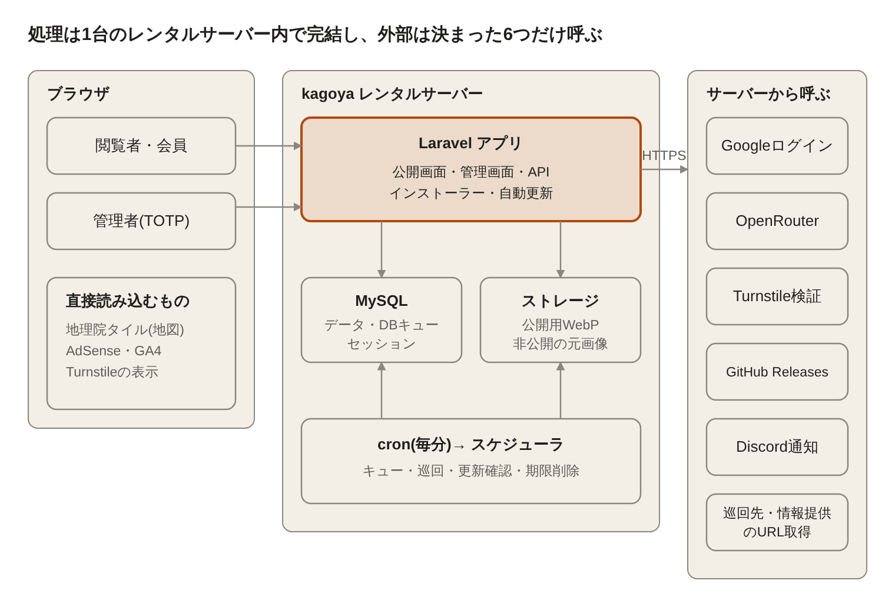
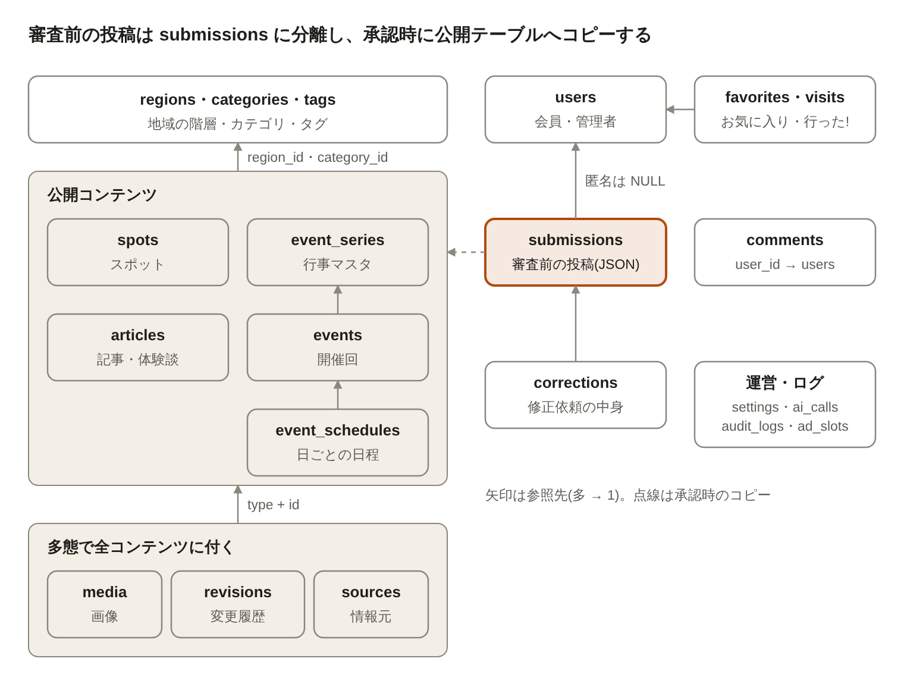
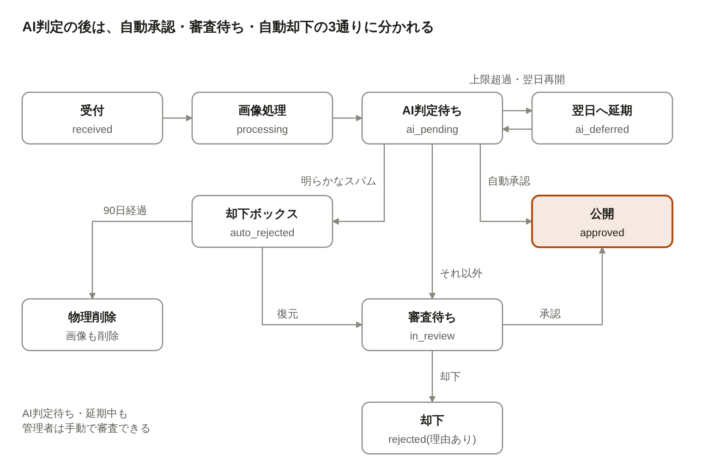

# ド田舎.net 設計書（香川版MVP）

Oct 6, 2026 · @ちょこ

## 1. システム構成

本体はkagoyaのレンタルサーバー1台で動くLaravelアプリである。常駐プロセスは使わず、重い処理は毎分のcronからDBキューで動かす。



(図の SVG: `docs/design/diagrams/design-system-architecture.svg`)

サーバーから外部へ出るのは、Googleログイン、OpenRouter、Turnstileの検証、GitHub Releases(更新の確認とダウンロード)、Discord Webhook(通知)、URLの取得(巡回、情報提供、管理者の下書き作成)だけ。地図タイル、広告、アクセス解析はブラウザが直接読み込むため、サーバー負荷にはならない。

| 項目 | 構成 |
| --- | --- |
| 言語・フレームワーク | PHP 8.4(kagoyaは8.4.26、apache2handler)、Laravel 13 |
| DB | MySQL 8.0.46(ngram全文検索が使える。2026-10-08 実機確認) |
| 非同期処理 | DBキュー+cron(毎分) |
| 配置 | コードはGitHubで管理。初回はリリースZIPを置いてWebインストーラー。以降はサーバーが1日1回GitHub Releasesを確認し、バックアップ→入れ替え→マイグレーション→ヘルスチェックで自動更新し、失敗したら戻す。リポジトリは公開の choko1229/doinaka。管理画面から手動でも更新でき、自動更新はアクセスが少ない時間帯(10.4)に行う。入れ替え中はメンテナンスモード、ZIPはGitHubのSHA-256と照合、バックアップは3世代、結果はDiscordへ通知する(chok.oooと同じ方式。2026-10-08変更) |
| 公開範囲 | ドキュメントルートを public に設定 |
| PHPの設定とcron | public/.htaccess の php\_value で memory\_limit 256M、upload\_max\_filesize 10M、post\_max\_size 110M、display\_errors Off(kagoyaで有効と確認済み)。cron は /opt/remi/php84/root/usr/bin/php -d memory\_limit=512M で動かす |
| 環境 | ローカル(Docker、本番と同じバージョン)と本番の2つ |
| バックアップ | kagoyaの自動バックアップ機能と、更新前に取るDBダンプ+コードZIP(3世代) |
| テスト | Pest(ユニット・機能テスト)、主要導線はPlaywrightでE2E。外部APIはモック |

## 2. アプリケーション構成

Laravelの標準構成に、ドメインごとのサービス層と差し替え可能なインターフェースを加える。コントローラは入力の受け取りと結果の返却だけを担い、業務ロジックはサービス層に置く。

### 2.1 レイヤー

| レイヤー | 役割 | 置き場所 |
| --- | --- | --- |
| ルーティング | 公開画面、管理画面、APIを分けて定義する | `routes/web.php`、`routes/admin.php`、`routes/api.php` |
| コントローラ | 入力受付と応答。業務ロジックは持たない | `app/Http/Controllers/{Public,Admin,Api,Auth}` |
| フォームリクエスト | 入力検証と認可 | `app/Http/Requests` |
| サービス | 業務ロジック(投稿、審査、検索、推薦、画像、AI) | `app/Services/{Submission,Review,Search,Recommend,Media,Ai,Setting}` |
| リポジトリ(検索のみ) | 複雑な絞り込みクエリを集約する | `app/Repositories` |
| モデル | Eloquentモデル、リレーション、スコープ | `app/Models` |
| ジョブ | 非同期処理(AI判定、画像処理、削除) | `app/Jobs` |
| ポリシー | 権限判定 | `app/Policies` |
| DTO・列挙型 | 状態や種別を型で表す | `app/Data`、`app/Enums` |
| ビュー | Bladeテンプレート | `resources/views/{public,admin,components}` |

### 2.2 差し替え可能なインターフェース

将来の変更が見込まれる部分は、インターフェースで抽象化してサービスコンテナで実装を切り替える。

| インターフェース | MVPの実装 | 将来の差し替え先 |
| --- | --- | --- |
| `AiProvider` | `OpenRouterProvider` | 他のAI API、ローカルモデル |
| `RecommendEngine` | `RuleBasedRecommendEngine` | AIによる推薦 |
| `SearchEngine` | `MysqlSearchEngine`(LIKE+全文インデックス) | Meilisearchなどの全文検索エンジン |
| `ImageProcessor` | `GdImageProcessor`(またはImagick) | 外部画像処理サービス |
| `GeoTileProvider` | 国土地理院タイル | 他の地図タイル |

### 2.3 フロントエンド

- Bladeテンプレート+素のJavaScript+CSS。部分更新が必要な絞り込みや「行った!」ボタンは、ページ内からAPI(`/api/v1`)を呼ぶ。
- 地図はLeaflet。ライブラリはビルドに含めてセルフホストし、外部CDNに依存しない。
- 文言はすべて `lang/ja` の翻訳ファイルから出す(多言語化への備え)。

### 2.4 型と品質

- 全ファイルで `declare(strict_types=1)` を宣言し、引数と戻り値に型を付ける。
- 状態や種別はPHPの列挙型(enum)で表し、文字列の直書きをしない。
- 静的解析(Larastan、レベルは最初から max)とコード整形(Laravel Pint)をCIで実行する(2026-10-08 決定)。

## 3. データベース設計

公開データと審査前データを分けて持つ。投稿は `submissions` にJSONで保存し、承認時に公開テーブルへコピーする。公開テーブルの変更はすべて `revisions` に記録する。

共通ルール:

- 主キーは `id`(BIGINT UNSIGNED、自動採番)。全テーブルに `created_at` と `updated_at` を持つ。
- 公開コンテンツ(events、event\_series、spots、articles、comments)は `deleted_at` による論理削除。個人情報(users、ip\_hashes、originals)は物理削除。
- 文字コードは utf8mb4、照合順序は utf8mb4\_ja\_0900\_as\_cs\_ks(kagoyaで使えると確認済み)。サーバーの既定の文字コードが binary なので、DB接続の設定とマイグレーションの両方で明示する。接続時に strict モードと time\_zone +09:00 も指定する。
- 状態や種別の列は文字列で持ち、アプリ側の列挙型(enum)と1対1で対応させる。
- 緯度経度は `DECIMAL(9,6)`。範囲検索のため `(lat, lng)` に複合インデックスを張る。events、spots、articles には、検索用の search\_text(正規化済みテキスト、全文インデックス)と人気順用の popularity\_score(1時間ごとに更新)も持たせる(11章)。

### 3.1 地域・分類

| テーブル | 主な列 | 備考 |
| --- | --- | --- |
| regions | parent\_id、level(prefecture / municipality / old\_municipality)、name、name\_kana、slug(ローマ字)、lat、lng、is\_active、sort\_order | 階層を親IDで表す。県ごとに accepts\_posts(投稿を受け付ける。初期値は全47都道府県でON)と crawl\_enabled(情報源を巡回する。初期値は香川県のみ ON)を持つ。初期データは全47都道府県と全市区町村(1741) |
| categories | target(event / spot)、name、slug、sort\_order、is\_active | イベント用とスポット用を target で分ける |
| tags | name、slug | 自由タグ |
| taggables | tag\_id、taggable\_type、taggable\_id | イベント・スポット・記事で共用する多態リレーション |

### 3.2 コンテンツ

| テーブル | 主な列 | 備考 |
| --- | --- | --- |
| event\_series | title、slug、summary、recurrence(yearly / irregular / once)、region\_id、category\_id、created\_by | 獅子舞・芸術祭などの継続行事。単発イベントも1件の series を持つ |
| events | series\_id、title、slug、body、region\_id、category\_id、venue\_name、address、lat、lng、fee、url、status(scheduled / cancelled / ended / undecided)、is\_published、published\_at、author\_user\_id、is\_anonymous、view\_count、favorite\_count、visited\_count | 開催回。status=undecided は「次回未定」の下書き |
| event\_schedules | event\_id、date、start\_time、end\_time、is\_all\_day、note | 日ごとの日程。複数行で、日によって違う時間を表す |
| spots | title、slug、body、region\_id、category\_id、address、lat、lng、hours、access、url、is\_published、published\_at、author\_user\_id、is\_anonymous、各種カウント | 常設の魅力スポット |
| articles | title、slug、body、region\_id、is\_published、published\_at、author\_user\_id、is\_anonymous、各種カウント | 記事・体験談 |
| article\_relations | article\_id、related\_type(event / spot)、related\_id | 記事に関連するイベント・スポット |
| sources | sourceable\_type、sourceable\_id、url、fetched\_at、license、note。イベントの情報元は event\_sources(9.7)で持ち、sources は地域ページの出典やオープンデータに使う | 情報元URL。AI下書きやオープンデータの出典表示に使う |
| revisions | revisionable\_type、revisionable\_id、before(JSON)、after(JSON)、cause(admin\_edit / submission / correction\_auto / rollback)、actor\_user\_id、submission\_id、contains\_personal | 全公開テーブル共通の変更履歴。無期限保持。contains\_personal の版は退会時に削除 |

### 3.3 画像

| テーブル | 主な列 | 備考 |
| --- | --- | --- |
| media | mediable\_type、mediable\_id、submission\_id、disk、path\_large、path\_medium、path\_small、width、height、alt、credit、rights\_agreed\_at、uploader\_user\_id、ai\_result(JSON)、sort\_order | 公開用のWebP(1600 / 800 / 400px) |
| media\_originals | media\_id、disk、path、mime、size、expires\_at | 受け取ったままの元画像。非公開領域に60日保存し、cronで物理削除 |

### 3.4 投稿・審査

| テーブル | 主な列 | 備考 |
| --- | --- | --- |
| submissions | receipt\_no、type(tip / event / spot / article / correction / comment / visit\_photo。event は巡回と管理者の下書き専用で、利用者は tip で送る)、action(create / update)、target\_type、target\_id、payload(JSON)、user\_id(匿名ならNULL)、ip\_hash、status、ai\_status、ai\_score、ai\_result(JSON)、reviewed\_by、reviewed\_at、reject\_reason、auto\_decision(approved / rejected / NULL)、expires\_at | 状態の遷移は8章。会員による編集は action=update で同じ仕組みに載せる |
| corrections | submission\_id、target\_type、target\_id、field、proposed\_value、source\_url、applied\_revision\_id | 修正依頼の中身。自動反映時は適用した revision を記録して戻せるようにする |

受付番号(receipt\_no)は「日付+ランダム英数字6文字」(例: 20261006-K7Q2MX)とし、推測しにくくする。

### 3.5 会員・反応

| テーブル | 主な列 | 備考 |
| --- | --- | --- |
| users | google\_sub(一意)、display\_name、bio、avatar\_url、role(member / editor / admin)、status(active / suspended)、approved\_count、totp\_secret(暗号化)、totp\_enabled\_at、last\_login\_at、email | メールアドレスは保存するが、管理者の会員詳細だけで表示し、公開ページ・API・ログには出さない。表示したことは操作ログに残す(2026-10-08 決定) |
| favorites | user\_id、favoritable\_type、favoritable\_id、list(favorite / want\_to\_go) | お気に入りと行きたいリスト |
| visits | visitable\_type、visitable\_id、user\_id、ip\_hash、cookie\_id、visited\_on | 「行った!」。会員は user\_id、匿名は Cookie と IPハッシュで1日1回 |
| comments | commentable\_type、commentable\_id、user\_id、thread\_id、reply\_to\_comment\_id、reply\_to\_user\_id、body(500文字)、is\_official、status | YouTube型。thread\_id はトップレベルのコメント、返信はすべて同じスレッドの末尾に並ぶ |
| page\_views | viewable\_type、viewable\_id、viewed\_on、count | 日別の閲覧数。人気順(直近30日)の集計元 |

### 3.6 運営・設定

| テーブル | 主な列 | 備考 |
| --- | --- | --- |
| ad\_slots | position、kind(adsense / custom)、title、body、image\_media\_id、link\_url、starts\_at、ends\_at、is\_active | 独自枠は「PR」表記を必須でテンプレート側に出す |
| ng\_words | word、match\_type(contains / exact) | 送信前フィルタ |
| settings | key、value(JSON)、is\_secret、updated\_by | 機密値は暗号化。キー一覧は14章 |
| ip\_hashes(論理名) | — | 個別テーブルにはせず、各テーブルの ip\_hash 列を cron で90日後にNULL化する |
| ai\_calls | purpose、priority、model、status、request\_tokens、response\_tokens、latency\_ms、error、submission\_id、created\_at | AI呼び出しログ。今日の使用回数の表示にも使う |
| audit\_logs | user\_id、action、target\_type、target\_id、detail(JSON)、ip\_hash | 管理操作の記録 |
| jobs / failed\_jobs / cache / sessions | Laravel標準 | DBキュー、キャッシュ、セッション |
| app\_meta | key、value | インストール済みフラグ、DBのスキーマバージョン、スケジューラの最終実行時刻、更新と巡回の時刻(10.4) |
| page\_view\_hours | hour(日時、1時間単位)、count | サイト全体の時間別閲覧数(管理者とボットを除く)。10.4の計算に使い、90日で消す |
| update\_runs | version\_from、version\_to、trigger(auto / manual)、status、log、started\_at、finished\_at | 更新の記録。管理画面「アップデート」の履歴に出す |
| inquiries | receipt\_no、kind(general / takedown / organizer / ad / privacy)、target\_url、right\_type、organizer\_name、body、email、ip\_hash、urgent、ai\_check(JSON)、status(new / reviewing / deleted / kept / replied / done)、handled\_by、handled\_at | お問い合わせ。メールは管理者だけが見て、ログに出さない。保存期間は設定 contact.retention\_days |

## 4. ER図

公開コンテンツは地域・カテゴリを参照し、イベントは「行事マスタ→開催回→日程」の3段で持つ。審査前の投稿は公開テーブルと切り離している。



(図の SVG: `docs/design/diagrams/design-er.svg`)

画像・変更履歴・情報元・コメント・お気に入り・「行った!」・タグは、type と id の組でどの公開コンテンツにも付く多態リレーションにしている。新しいコンテンツ種別を足しても、これらのテーブルは変えずに済む。

## 5. 認証・権限設計

会員も管理者もGoogleログインで入り、管理画面に入るときだけTOTP(認証アプリの6桁コード)を追加で求める。権限はロールと権限の対応表で判定する。

### 5.1 ログインの流れ

1. Googleログイン(Laravel Socialite)。OAuthのstateで改ざんを防ぐ。
2. `google_sub` で会員を探し、なければ作成して表示名の設定画面へ進む。
3. role が admin / editor の会員が `/admin` に入ると、TOTPの入力を求める。未設定ならTOTPの登録画面へ進む。
4. TOTPに成功すると、セッションに「管理者として確認済み」と時刻を記録する。12時間で失効する(設定で変更可)。
5. 停止中(status=suspended)の会員は、ログインと閲覧、マイページでの確認と退会はできるが、投稿・情報提供・コメント・反応はできない(2026-10-08 決定)。

### 5.2 最初の管理者

Webインストーラーの最後の手順で、Googleのクライアント情報を登録してからGoogleログインし、その会員を admin にしてTOTPを登録する。インストール完了後は、管理画面の会員管理からしかロールを変更できない。

### 5.3 権限表

| 権限 | 閲覧者 | 会員 | 編集者(将来) | 管理者 |
| --- | --- | --- | --- | --- |
| 閲覧・検索・地図 | ○ | ○ | ○ | ○ |
| 投稿・修正依頼 | ○(匿名) | ○ | ○ | ○ |
| 「行った!」 | ○(1日1回) | ○ | ○ | ○ |
| コメント・返信 | — | ○ | ○ | ○ |
| お気に入り・マイページ | — | ○ | ○ | ○ |
| 公式回答バッジ付きコメント | — | — | ○ | ○ |
| 審査・コンテンツ編集 | — | — | ○ | ○ |
| マスタ・会員管理 | — | — | — | ○ |
| 設定・AI・広告・更新適用 | — | — | — | ○ |

権限はコード上の定数(`Permission` 列挙型)とロールの対応表で持ち、Laravelのポリシーで判定する。画面やコントローラで直接ロール名を比較しない。

### 5.4 セッションとCookie

- セッションはDBに保存する。Cookieには Secure、HttpOnly、SameSite=Lax を付ける。
- 匿名の「行った!」用に、ランダムな `cookie_id` を1年有効のCookieで発行する。個人を特定する情報は入れない。
- ログイン時とTOTP成功時にセッションIDを再生成する。

## 6. ルーティング・画面設計

URLの先頭に県のスラッグ `{pref}` を置き、存在しない県は404を返す。個別ページは「ID+ローマ字」で、IDだけで記事を特定する。ローマ字部分が現在の値と違えば、正しいURLへ301リダイレクトする。共有用の do-inaka.net に来たリクエストは、ミドルウェアで同じパスのド田舎.net(xn--gdkt37rmci.net)へ301で転送する。Turnstile には両方のホスト名を登録する。

### 6.1 公開側(routes/web.php)

| URL | 画面 | コントローラ |
| --- | --- | --- |
| `/` | トップ | `Public\HomeController@index` |
| `/{pref}/` | 県トップ。9.8 の県の地域ページ(基本情報・紹介文・市区町村の一覧)を兼ねる | `Public\PrefectureController@show` |
| `/{pref}/{city}/`、`/{pref}/{city}/{old}/` | 地域ページ(市区町村・合併前の旧町村。例: /kagawa/marugame/hanzan/)。9.8 | `Public\RegionController@show` |
| `/{pref}/events/` | イベント一覧・検索(一覧/カレンダー切替) | `Public\EventController@index` |
| `/{pref}/events/weekend/、/{pref}/events/category/{slug}/` | 検索向けの固定の絞り込みページ(今週末、カテゴリ別)。15.2 | `Public\EventController@index` |
| `/{pref}/events/{id}-{slug?}/` | イベント詳細 | `Public\EventController@show` |
| `/{pref}/series/{id}-{slug?}/` | 行事マスタ(過去の開催回一覧) | `Public\SeriesController@show` |
| `/{pref}/spots/`、`/{pref}/spots/{id}-{slug?}/` | スポット一覧・詳細 | `Public\SpotController` |
| `/{pref}/articles/`、`/{pref}/articles/{id}-{slug?}/` | 記事一覧・詳細 | `Public\ArticleController` |
| `/{pref}/map/` | 地図 | `Public\MapController@index` |
| `/post/`、`/post/{type}/`、`/post/done/` | 投稿フォーム(種類選択→入力→完了)。種類はイベントの情報提供(tip)、スポット、記事・体験談。「行った!」の写真はイベント詳細から送る(9.7) | `Public\SubmissionController` |
| `/report/{type}/{id}/` | 修正依頼フォーム | `Public\CorrectionController` |
| `/login/`、`/auth/google/callback` | ログイン | `Auth\GoogleController` |
| `/mypage/`、`/mypage/submissions/`、`/mypage/lists/`、`/mypage/profile/`、`/mypage/withdraw/` | マイページ | `Member\*` |
| `/users/{id}/` | 投稿者プロフィール | `Public\UserController@show` |
| `/terms/`、`/privacy/`、`/policy/`、`/about/`、`/ads/`、`/contact/`(`/takedown/` は `/contact/?type=takedown` へ301) | 固定ページ、削除依頼、掲載枠の問い合わせ | `Public\PageController` |
| `/sitemap.xml`、`/robots.txt` | SEO | `Public\SeoController` |

### 6.2 管理側(routes/admin.php、`/admin` 配下)

| URL | 画面 |
| --- | --- |
| `/admin/` | ダッシュボード(未処理バッジ、AIの今日の使用回数と制限エラーの有無) |
| `/admin/review/`、`/admin/review/{id}/` | 審査一覧・審査詳細(AI判定、重複候補、整形提案の差分) |
| `/admin/review/rejected/` | 却下ボックス |
| `/admin/corrections/` | 修正依頼(自動反映済みの「要確認」を含む) |
| `/admin/series/`、`/admin/events/` | 行事マスタ・開催回(「日程未入力」の絞り込みあり) |
| `/admin/spots/`、`/admin/articles/`、`/admin/comments/` | 各コンテンツ |
| `/admin/revisions/{type}/{id}/` | 変更履歴と巻き戻し |
| `/admin/drafts/` | AI下書き作成(URL入力) |
| `/admin/regions/`、`/admin/categories/`、`/admin/tags/`、`/admin/ng-words/` | マスタ |
| `/admin/users/` | 会員管理 |
| `/admin/ads/` | 広告枠 |
| `/admin/settings/` | 設定(14章) |
| `/admin/logs/` | 操作ログ、審査ログ、AIログ、エラーログ |
| `/admin/tips/` | 情報提供の確認(送られたURL・写真とAIの下書きを並べ、直して公開か見送り。2件目以降は内容が同じ行事にまとめる)。9.7 |
| `/admin/region-pages/` | 地域ページ(紹介文の状態、再生成、修正の保留)。9.8 |
| `/admin/sources/` | 情報源の巡回(情報源、候補、巡回の記録)。9.6 |
| `/admin/bar` | 管理者バーの部品を返す(公開ページから読み込む)。6.5 |
| `/admin/inquiries/` | お問い合わせ(種類・状態で絞り込み、返信、削除依頼の対象の削除・再公開)。6.6 |
| `/admin/update/` | 更新の適用(マイグレーション) |

### 6.3 インストーラー

`/install/` は app\_meta にインストール済みフラグがない場合だけ有効になる。手順は、動作環境チェック、DB接続、`.env` の生成、テーブル作成、サイト基本情報、Googleクライアント情報、最初の管理者のログインとTOTP登録の順。完了後は `/install/` へのアクセスを404にする。

### 6.4 画面の共通方針

- スマートフォンでの閲覧を優先する。一覧はカード形式、詳細ページの上部に日時・場所・地図を置く。
- 一覧の絞り込み条件はすべてURLのクエリに持ち、共有やブラウザの戻るで再現できるようにする。
- 終了したイベントの詳細には「終了しました」と表示し、同じ行事の次回開催回があればそこへ案内する。

### 6.5 管理者バー

管理者がログインしたまま公開ページを見ると、画面の上端にWordPressの管理バーのような帯を出す。そこから管理画面へ移動したり、見ているページをその場で操作したりできる(2026-10-08 決定)。

| 項目 | 決めたこと |
| --- | --- |
| 出す条件 | 管理者ロールで、TOTP確認が有効な間だけ。一般の人、会員、ログインしていない人には出さない |
| 出し方 | 公開ページのHTMLには入れない。ページ表示後に `/admin/bar?url=…` を読み込み、返ってきた部品を差し込む。公開ページのキャッシュに管理者の情報が混ざらない |
| いつも出す項目 | 管理画面へのリンク、審査待ちの件数、修正依頼の件数、＋新規(イベント・スポット・記事)、今日のAI使用回数(制限エラー中はその表示)、ユーザーメニュー(ログアウト) |
| ページごとの操作 | イベント: 編集、情報元を読み直す、中止にする、非公開にする、履歴。地域ページ: 紹介文を再生成、編集、履歴、検索への公開の切り替え。スポット・記事: 編集、非公開にする、履歴 |
| 操作の安全 | 変更する操作はすべてPOSTとCSRFトークン。中止と非公開は確認ダイアログを出す。操作は audit\_logs に残す |
| 見た目 | 配色テーマに関係なく濃い固定色にして、公開ページと見分けやすくする。スマホでは1行に縮め、「このページ」ボタンで操作を開く |
| 集計 | 管理者の閲覧はページビュー、人気順、アクセスの少ない時間帯の計算に数えない |

### 6.6 固定ページとお問い合わせ

利用規約(`/terms/`)、プライバシーポリシー(`/privacy/`)、運営者情報(`/about/`)、お問い合わせ(`/contact/`)を置き、全ページのフッターからたどれるようにする(2026-10-08 決定)。文面は[利用規約・プライバシーポリシーほか(下書き)](https://claude.ai/code/artifact/14e9c1eb-e887-4069-90e4-10b553178e8a)にある。

| 項目 | 決めたこと |
| --- | --- |
| 運営者情報 | 活動名 choko1229(香川県在住の個人)だけを出す。本名・住所・電話は出さず、連絡はフォームだけ |
| お問い合わせの種類 | 一般の質問・不具合、削除依頼(権利侵害・個人情報)、掲載・修正の依頼(主催者)、広告・独自掲載枠の相談、個人情報について(開示等の請求) |
| メールアドレス | 返信が必要な人だけ入れる(任意)。広告と個人情報は必須。返信以外に使わない |
| 削除依頼 | 対象URLと権利の種類が必須。自動で非公開にはしない(2026-10-08 変更)。対象(写真1枚かページ全体)をぼかし、目立つ位置に「確認中」と表示する。AIが依頼と対象を照合し(用途 takedown\_check)、その結果を見て管理者が「削除」か「ぼかしを外して残す」を決める。照合と管理者の確認が済むまで削除しない。権利が「プライバシー(住所・電話・名前)」か「肖像権」の依頼は「急ぎ」として Discord に通知し、照合をAIの優先度1で行う。ぼかしはサーバー側で行い(画像はぼかしたものを配信、ページ全体のときは本文をHTMLに含めない)、ソースを見ても中身が分からないようにする。確認中のページは noindex。受付から7日以内に結論を出すのを目標にする。依頼は同じIPハッシュから1日3件まで。ぼかしの「タップして見る」は著作権・名誉・その他の依頼では出し、プライバシー・肖像権の依頼では出さない(2026-10-08 決定) |
| 受付と通知 | 受付番号を表示する(投稿と同じ形式)。Discord には受付番号と種類だけを送り、内容とメールは送らない |
| フォームの守り | Turnstile、ハニーポット、IPハッシュ単位のレート制限(投稿と同じ) |
| 同意の表示 | 会員登録・投稿・情報提供・お問い合わせの送信ボタンのすぐ近くに「利用規約とプライバシーポリシーに同意して送信します」と両ページへのリンクを置く(民法548条の2、定型約款を契約に組み入れるため。2026-10-08 ファクトチェックで追加) |
| 外国への提供の同意 | 投稿・情報提供・お問い合わせに「AIで確認するため、内容を外国(米国など)の事業者に送ることに同意する」のチェックボックス(プライバシーポリシ5へのリンク付き)。チェックしないと送れない。同意の日時と版を残す(個人情報保護法28条。2026-10-08 決定) |
| メールの送信 | 送信元 contact@do-inaka.net(kagoya のメール、SPF・DKIM を設定)。AdminInquiries の返信フォームからキューで送る。削除依頼の結果の通知も同じ。SMTP の接続情報は settings に暗号化して保存。本文とアドレスはログに出さない(2026-10-08 決定) |
| 削除への同意照会 | 対象が会員の投稿なら、マイページで依頼の内容(依頼者の情報は除く)を示して「同意する / 反対する(理由)」を聞く。7日(takedown.objection\_days)反対がなければ「削除できる」になる。削除は管理者が押したときだけ。匿名の投稿には照会しない(情報流通プラットフォーム対処法3条2項2号。2026-10-08 決定) |
| 海外からのアクセス | 日本のIP(APNIC の一覧で JP の IPv4・IPv6。週1回更新)以外は 403 と BlockedPC / SP。例外は本物と確かめた検索エンジンのクローラー、robots.txt・サイトマップ、/terms/ /privacy/ /about/ /contact/。一覧が空なら制限しない(geo.block\_overseas、2026-10-08 決定) |
| 同意バナー | 日本向けの簡易版(CookieBanner)。「同意する」「拒否する」。選ぶまでは同意モード v2 で拒否として扱い、結果を Cookie で1年覚える。フッターの「Cookie の設定」で変えられる(2026-10-08 決定) |
| 外部送信の公表 | プライバシーポリシーの節4にまとめる(電気通信事業法の外部送信規律)。読み込む外部サービスを増やしたら、この表も直す |
| 画面 | LegalPC / SP(利用規約とプライバシーポリシー)、AboutPC / SP、ContactPC / SP、ReviewNoticePC / SP(確認中の表示)、AdminInquiriesPC / SP |

## 7. API設計

`/api/v1` は公開画面の部分更新と、将来のアプリ・外部連携のための読み取り中心のAPIである。画面と同じサービス層を呼ぶので、絞り込みのロジックは1か所にまとまる。

### 7.1 共通仕様

- 形式はJSON。成功時は `{"data": ..., "meta": {...}}`、失敗時は `{"error": {"code": "...", "message": "..."}}`。
- 一覧はページ番号方式(`page`、`per_page`、上限50)。
- 認証は同じドメインのセッションCookieを使い、更新系はCSRFトークンを必須にする。外部向けのトークン認証はMVPでは作らない。
- 日時はISO 8601(日本時間 +09:00)で返す。
- レート制限: 読み取りは1IPあたり毎分120回、更新系は毎分20回(設定で変更可)。

### 7.2 エンドポイント

| メソッド | パス | 用途 | 認証 |
| --- | --- | --- | --- |
| GET | `/api/v1/{pref}/events` | イベント検索(q、area、category、tag、date\_from、date\_to、preset=today / weekend、lat、lng、radius\_km、sort=date / popular / distance) | 不要 |
| GET | `/api/v1/{pref}/events/calendar` | 月ごとの日別件数(カレンダー表示用) | 不要 |
| GET | `/api/v1/{pref}/spots` | スポット検索(日付以外はイベントと同じ) | 不要 |
| GET | `/api/v1/{pref}/articles` | 記事一覧 | 不要 |
| GET | `/api/v1/{pref}/map/pins` | 地図用のピン(表示範囲 bbox、種別、カテゴリ、日付) | 不要 |
| GET | `/api/v1/{type}/{id}/related` | 関連・近くの情報 | 不要 |
| GET | `/api/v1/recommendations` | 個人向けおすすめ(未ログインなら人気順) | 任意 |
| GET | `/api/v1/regions` | 地域の階層 | 不要 |
| POST | `/api/v1/{type}/{id}/visit` | 「行った!」 | 不要(1日1回) |
| POST / DELETE | `/api/v1/{type}/{id}/favorite` | お気に入り・行きたいリスト(list パラメータ) | 会員 |
| GET | `/api/v1/{type}/{id}/comments` | コメント(スレッド単位、返信は折りたたみ) | 不要 |
| POST | `/api/v1/{type}/{id}/comments` | コメント・返信の投稿(審査に入る) | 会員 |

投稿フォームと修正依頼フォームは、画像アップロードとTurnstileを伴うため、APIではなく通常のフォーム送信(`/post/`、`/report/`)で受け付ける。

## 8. 投稿・審査の状態遷移

投稿の状態は submissions.status の9つで管理し、遷移は `SubmissionStateMachine` だけが行う。コントローラやジョブが status を直接書き換えないようにする。



(図の SVG: `docs/design/diagrams/design-submission-status.svg`)

- 画像のない投稿は「画像処理」を飛ばしてAI判定待ちに入る。
- 自動承認の条件: 会員であること、承認実績5件以上、安全スコア0.9以上、顔の写った画像がないこと、重複候補がないこと。修正依頼はこれに加えて情報元URLが必要。
- 自動却下の条件: AIがスパムと判定し、安全スコアが review.auto\_reject\_max\_score 以下。
- 承認時は1つのトランザクションで、公開テーブルへの書き込み、revisions への記録、画像の付け替え(submission\_id から公開コンテンツへ)、投稿者の approved\_count の加算を行う。
- 会員の編集(action=update)は、承認されるまで公開中の版をそのまま表示する。承認時に公開テーブルを更新し、変更前後を revisions に残す。
- 修正依頼の自動反映は revisions(cause=correction\_auto)として記録し、管理画面の「要確認」に並べる。「戻す」を押すと before の内容で上書きし、その操作も revisions(cause=rollback)に残る。
- 人が却下した投稿(rejected)も、却下ボックスと同じく90日後に物理削除する(2026-10-08 決定)。

## 9. AI連携設計

無料枠の呼び出しを節約するため、テキストの判定・整形・重複照合・ローマ字提案は1回の呼び出しにまとめる。画像がある投稿だけ、画像チェックを1回追加する。つまり1投稿あたり1〜2回で済む。

### 9.1 構成

- `AiProvider` インターフェースに `complete(AiRequest): AiResponse` を定義し、`OpenRouterProvider` が実装する。
- 用途(purpose)ごとにモデルの候補リストを設定で持つ。OpenRouterのフォールバック指定を使い、1つ目が混雑・終了していたら次のモデルを試す。
- 呼び出しはすべてキューのジョブから行い、画面のリクエスト中には呼ばない。ただし管理者の「AIに提案させる」ボタンとURLからの下書き作成は、即時に結果を返すため同期で呼ぶ(タイムアウト30秒)。

### 9.2 用途と呼び出し

| 用途 | タイミング | 入力 | 出力(JSON) |
| --- | --- | --- | --- |
| review\_text | 投稿・コメント・修正依頼の受付後(キュー) | 投稿内容、重複候補3件までの要約、カテゴリ一覧、エリア一覧 | safety\_score(0〜1)、is\_spam、reasons\[\]、normalized(整形後の各項目)、summary、category\_slug、region\_slug、tags\[\]、duplicate\_of(ID or null)、romaji\_slug |
| review\_image | 画像付き投稿の受付後(キュー) | 縮小した画像(800px) | inappropriate、has\_faces、reasons\[\] |
| draft\_from\_url | 管理者のURL入力(同期) | 取得したページの本文テキスト | 日時・会場・住所・料金・主催者・情報元URLのみ。本文の文章は返させない |
| suggest | 管理者のボタン(同期) | 編集中の内容 | normalized、tags\[\]、romaji\_slug |
| tip | 情報提供(URL)の受付後(キュー、優先度3) | 送られたURLの本文テキスト(1ページだけ) | draft\_from\_url と同じ。行事でなければ is\_event=false |
| crawl | 巡回で変化のあったページ(キュー、優先度4) | ページの本文テキスト、既存の行事候補 | 行事ごとの事実、confidence(0〜1)、中止・延期の有無、既存の行事ID |
| region\_intro | 地域ページの生成(キュー、優先度5) | 情報元の本文(自治体の沿革、統計) | 段落ごとの文と出典番号 |
| fact\_check | region\_intro の直後と、地域ページの修正依頼 | 確かめる文と情報元 | 文ごとの supported(true / false)と根拠の出典番号 |
| takedown\_check | 削除依頼の受付後(キュー、優先度2。急ぎは1) | 依頼の内容と権利の種類、対象の文章・写真(メールアドレスは送らない) | verdict(妥当そう / 根拠不足 / 判断できない)、confidence、reasons\[\]。削除はしない(管理者が決める) |

- 重複候補はAIに探させず、先にDBで絞る。条件は同じ種別、開催日が前後1日以内(イベントのみ)、1km以内、タイトルの全文検索一致。上位3件だけをAIに渡す。
- AIの出力はJSONスキーマで検証し、外れた場合は1回だけ再試行する。それでも外れたら「AI判定失敗」として人の審査に回す。

モデルの選び方(2026-10-08 決定): 管理画面で用途ごと(文章・画像)に第1候補と予備を選ぶ(settings の ai.models.{用途} に順番つきで保存)。候補は OpenRouter の /api/v1/models を日に1回取り直した一覧から :free だけを出す。第1候補が消えたら予備に切り替え、Discord に1回通知する。予備もなければ人の審査に回す。

### 9.3 無料枠の管理

- 1日の回数は `ai_calls` テーブルをUTCの日付で数えて表示する(OpenRouterの日次リセットに合わせる)。
- 回数の上限は決めず、OpenRouterの無料枠で制限エラーが返るまで使う(2026-10-08 決定)。順番待ちのジョブは、管理者の操作 → 投稿の判定 → 情報提供の読み取り → 巡回 → 地域ページの紹介文の順に取り出す。
- 制限エラーが出たあとのジョブは失敗にせず、翌日0時(UTC、日本時間9時)のリセット以降に、上の優先順で再実行する。管理者の操作だけは、画面からすぐ再試行できる。審査画面には「AI判定待ち」と表示し、管理者は手動で審査できる。
- OpenRouterから429(回数超過)や402(残高不足)が返ったら、リセットまで新しい呼び出しを止める。止まっていることはダッシュボードと管理者バーに表示する。

### 9.4 安全とプライバシー

- AIに送るのは、公開予定の投稿内容、情報提供で送られた公開中のWebページの本文、削除依頼の内容と対象のページだけ。個人情報保護法28条は、投稿・情報提供・お問い合わせの各フォームで外国の事業者に送ることへの同意を取って対応する(B案。2026-10-08 決定)。学習に使う無料の提供元も使うが、削除依頼の照合(takedown\_check)だけはリクエストで provider.data\_collection を deny にして、記録・学習しない提供元に限る。IPハッシュ、会員ID、Cookie、元画像の位置情報は送らない(画像は位置情報を除いた縮小版を送る)。
- 投稿本文は「判定対象のデータ」として区切って渡し、本文中の指示には従わないようシステムプロンプトで明示する(プロンプトインジェクション対策)。出力はスキーマで検証し、想定外の項目は捨てる。
- AIの出力は提案として保存し、公開データに直接書くのは自動承認・自動反映の条件を満たした場合だけ(8章)。
- プロンプトは `resources/prompts/` にファイルで置き、バージョンを `ai_calls` に記録する。

### 9.5 ローマ字スラッグ

AIの提案(romaji\_slug)を優先し、AIが使えないときは読み仮名(かな)をヘボン式に変える自作クラス KanaToRomaji で補う(既存のライブラリは更新が止まっているか、ひらがなだけの対応のため。2026-10-08 決定)。読み仮名がない漢字は変換しない。どちらも得られなければID だけのURLにする。管理者は承認時に確認・修正できる。

### 9.6 情報源の巡回(香川県のみ)

管理者が登録した情報源(Webページと RSS/Atom)を、アクセスが少ない時間帯に自動で巡回し、今日から1年先までのイベントを取り込む。対象は crawl\_enabled が ON の県(初期値は香川県のみ)。取り込んだものは審査に回し、「信頼済み」の情報源だけ自動で公開する(2026-10-08 決定)。

| 項目 | 決めたこと |
| --- | --- |
| 情報源の種類 | Webページ: 登録した一覧ページと、そこからリンクされた同じサイト内の詳細ページ(1階層まで)。RSS/Atom: 新しい項目のリンク先を詳細ページとして読む |
| 情報源の増やし方 | 管理者が登録。巡回中に見つけたイベントらしいページへのリンクと、情報提供のURLを「候補」に集め、管理者が登録か無視を選ぶ |
| 巡回の時間帯 | 自動アップデートと同じ「アクセスが少ない時間帯」の計算で決め、更新とは1時間ずらす |
| 頻度 | 毎日から始め、変化がなければ2日→4日→7日おきと間を空ける。変化があれば毎日に戻す |
| 取り込む期間 | 今日から1年先まで。終わった行事とそれより先は入れない |
| 相手サイトへの配慮 | robots.txt を守る。同じサイトは10秒以上あける。1回の巡回で1サイト30ページまで。User-Agent にサイト名と問い合わせ先 |
| 変化の検出 | ETag・Last-Modified と本文のハッシュで判定し、変わったページだけAIで解析する(AIを使う順番は4番目) |
| 取り込む内容 | 行事名・日時・場所・主催・料金などの事実と情報元URLだけ。本文や画像は複製しない |
| 公開の仕方 | 通常は下書きとして審査へ。信頼済みの情報源は自動公開。ただし「日時・場所が読めないか確信度0.9未満」「既存の行事と食い違う」「中止・延期の知らせ」は人の審査に回す |
| 信頼済み | 直近10件を修正なしで承認できたら管理画面で提案し、管理者がONにする。自動公開したものを管理者が直したり取り消したら、自動でOFFに戻して知らせる |
| 同じ行事の扱い | 名前・日付・市町が近いものは新しい行事にせず、公式の値で修正依頼を作る(公式を優先、反映は管理者が決める) |
| 壊れたとき | 取得失敗や「前回あったのに0件」が3回続いたら一時停止し、Discord と管理画面で知らせ、信頼済みも外す |
| テーブル | crawl\_sources(情報源)、crawl\_pages(ページごとのハッシュと取得日時)、crawl\_runs(巡回の記録)、crawl\_candidates(候補) |

巡回の User-Agent は「DoinakaBot/1.0 (+https://do-inaka.net/about/)」。robots.txt は DoinakaBot と \* の両方の指示を守る(2026-10-08 決定)。

### 9.7 イベントの情報提供とページの作り方

イベントのページは、巡回か情報提供をもとに運営が作る。利用者の投稿から直接は作らず、情報元が1つもないイベントは公開できない(2026-10-08 決定)。

| 情報元の種類 | 取り込み方 | ページでの表示 |
| --- | --- | --- |
| Webページ(URL) | 情報提供のURLを巡回と同じ仕組みで1ページだけ読み(robots.txt を守る)、AIで下書きにする。香川県外も対象。定期巡回には入れず「情報源の候補」に載せる | ページ名へのリンク、公式かどうか、確認した日 |
| チラシ・回覧板の写真 | 管理者が読んで下書きを作る。個人の名前・電話番号を隠してから保存する | 「地区のチラシ(提供写真)」と、隠したあとの写真 |
| 管理者の現地確認 | 管理者が取材して自分で作る | 「ド田舎.net 現地確認(日付)」 |

- 公開の条件: 巡回と同じ。情報提供のURLが信頼済みの情報源のサイトなら自動公開の対象、それ以外は人が確認する
- 情報提供のひとことは確認の参考にだけ使い、ページにそのまま載せない
- テーブル: event\_sources(イベントごとの情報元。kind = url / flyer / onsite、url、media\_id、checked\_at、is\_official)。events を公開にするときに1件以上あることを検証する
- 写真: 参加した人が「行った!」と一緒に投稿し、審査してからイベントの写真に加える(撮影者の表示あり)
- 修正依頼: 情報元は任意のまま(情報元がなければ自動反映はせず人が判断する)
- AIの回数: 情報提供の読み取りは、AIを使う順番の3番目(投稿の判定の次)

### 9.8 地域ページ(県・市区町村・旧町村)

県、市区町村、合併前の旧町村の3階層にページを作り、成り立ちや特徴を紹介する。旧町村は平成の大合併前(香川34)と昭和の大合併前(香川150)の両方で、「平成の合併前」「昭和の合併前」のタグを付ける。昭和の旧村は、その後に入った平成の旧町のページにも並べる。区域が分かれた旧村は、主な行き先の市町を URL 上の親にし、ほかの市町のページにも載せる(データは docs/data/kagawa\_former\_municipalities.csv。2026-10-08 決定)。紹介文はAIが情報元をもとに自動で作り、別の呼び出しでファクトチェックしてから公開する(2026-10-08 決定)。

| 項目 | 決めたこと |
| --- | --- |
| URL | `/kagawa/`(県)、`/kagawa/marugame/`(市町)、`/kagawa/marugame/hanzan/`(旧町村)。スラッグは読みのローマ字で、同じ県の中で重なったときだけ -shi / -cho / -son を付ける。events / series / spots / articles / map などは予約語で使わない。名前が変わったら古いURLから301 |
| 階層 | 県(47)→ 市区町村(1741)→ 合併前の旧町村。地区や大字は入れない |
| ページの中身 | 基本情報(読み、人口、面積、合併の年と合併前の町村。統計から自動で作り、時点と出典を表示)、紹介文(成り立ち・特徴)、次の階層の一覧、その地域のイベントとスポット、地図、出典 |
| 最初に用意するもの | 全47都道府県の県ページと、香川県の17市町・旧町村は、設置後に生成キューへ入れる |
| それ以外 | 基本情報だけですぐ表示し、「紹介文を準備中」と出す。初めてアクセスがあったときに生成キューへ入れる(同じページは1回だけ)。アクセスが多い順に作る |
| AIの回数 | 紹介文の生成はAIを使う順番の最後。ほかのジョブが空いているときに作り、制限エラーが出たらリセット後に続ける。1ページ約3回(下書き・ファクトチェック・予備) |
| 情報元 | 自治体公式サイトの概要・沿革ページ、総務省・国土地理院の統計、Wikipedia(事実の確認だけに使い、文章は使わない)。段落ごとに出典番号を付ける |
| ファクトチェック | 下書きの文をひとつずつ情報元と照合し、裏付けのない文は消す。残った文が少なすぎれば公開しない |
| 修正の受付 | 「内容の違いを知らせる」→ AIが情報元(送られたURLか既存の出典)と照合 → 裏付けがあれば自動で直して履歴に残す。なければ保留して管理者が見る |
| 表示 | 紹介文に「AIが情報元をもとに作成」と最終確認日を出す |
| 再生成 | 管理画面の地域ページ一覧と、公開ページの管理者バーに「再生成」ボタンを置く。押すと生成キューの先頭に入る。新しい紹介文がファクトチェックを通るまで今の紹介文を出し続け、古い紹介文は履歴に残して戻せる。一覧では複数選んでまとめて再生成できる。準備中のページには「すぐ作る」を出す |
| 検索エンジン | 基本情報だけのページは noindex。ファクトチェックを通り、出典2件以上の紹介文があるページだけ検索に出し、サイトマップに入れる |
| テーブル | regions(3.1。level は prefecture / municipality / old\_municipality、読みは name\_kana)に merged\_into、merged\_at を足す。region\_profiles(紹介文、出典、状態: なし / 待ち / 下書き / 確認済み、使ったモデル、確認日)、region\_stats(人口・面積と時点・出典) |

注: 無料モデルでは、長い歴史の文章は間違いが混じりやすい。ファクトチェックで裏付けのない文を落とすため、紹介文は短めになる前提で作る。香川県の分(約60ページ、約180回)がそろうまでの日数は、無料枠がその日どれだけ空いているかで決まる。

## 10. キュー・cron設計

サーバーに登録するcronは1行だけにする。毎分 `php artisan schedule:run` を呼び、その中でキュー処理と定期処理をLaravelのスケジューラが振り分ける。常駐プロセスは使わない。

```
* * * * * cd /path/to/app && /opt/remi/php84/root/usr/bin/php -d memory_limit=512M artisan schedule:run >> /dev/null 2>&1
```

### 10.1 キュー

- ドライバはDB(`jobs` テーブル)。
- 毎分 `queue:work --stop-when-empty --max-time=50` を実行し、次のcronと重ならないよう50秒で終える。多重起動は `withoutOverlapping` で防ぐ。
- キューは優先度別に3本。`high`(画像処理)、`ai`(AI判定)、`low`(集計・通知の更新)の順に処理する。ai キューの中は priority 列(1: 管理者の操作、2: 投稿の判定、3: 情報提供の読み取り、4: 巡回、5: 地域ページの紹介文)の小さい順に取り出す。

| ジョブ | キュー | 失敗時 |
| --- | --- | --- |
| ProcessUploadedImage(リサイズ・WebP化・EXIF除去) | high | 3回再試行。失敗したら投稿を「画像処理失敗」で人の審査へ |
| RunTextReview | ai | 無料枠超過は翌日へ遅延。その他は3回再試行後に人の審査へ |
| RunImageReview | ai | 同上。画像対応の無料モデルがなければ実行せず人の審査へ |
| ApplyAutoDecision | ai | AI判定がそろったら自動承認・自動却下・審査待ちを決める |
| ApplyCorrection | ai | 修正依頼の自動反映。revisions に記録 |
| RecalculatePopularity | low | 次回の定期実行で回復 |

### 10.2 定期処理(スケジューラ)

| 処理 | 頻度 | 内容 |
| --- | --- | --- |
| キュー処理 | 毎分 | 上記 |
| イベント終了処理 | 1時間ごと | 最終日程を過ぎた開催回を ended にし、毎年開催の行事なら「次回未定」の下書きを作る |
| 人気スコア集計 | 1時間ごと | page\_views、favorites、visits の直近30日を重み付けして各コンテンツに保存 |
| 却下ボックスの期限削除 | 毎日 | 90日を過ぎた却下投稿と添付画像を物理削除 |
| 元画像の期限削除 | 毎日 | 60日を過ぎた media\_originals を物理削除 |
| IPハッシュの期限削除 | 毎日 | 90日を過ぎた ip\_hash を各テーブルでNULLにする |
| 古いログの整理 | 毎週 | ai\_calls・audit\_logs の保持期間(設定値)を過ぎたものを削除 |
| 遅延したAIジョブの再開 | 毎日 UTC 0時すぎ | 無料枠超過で止まったジョブを優先順に再投入 |
| サイトマップ再生成 | 1時間ごと | 公開コンテンツの更新があれば作り直す |
| 時間別閲覧数の集計 | 1時間ごと | 直前1時間の閲覧数を page\_view\_hours に足す(管理者とボットを除く) |
| 時間帯の再計算 | 毎週月曜 | 10.4 の方法で更新と巡回の時刻を決め直す |
| 情報源の巡回 | 毎日、更新の1時間前 | 間隔が来た情報源を読み、変化のあったページを ai キュー(優先度4)へ入れる(9.6) |
| 更新の確認と適用 | 毎日、更新の時間帯のはじめ | GitHub Releases の最新を確認し、自動更新がONなら適用する(1章の配置) |
| 地域ページの生成待ちの投入 | 1時間ごと | 生成待ちの地域ページを、アクセスが多い順に ai キュー(優先度5)へ入れる(9.8) |

追加の定期処理(2026-10-08): 日本のIPアドレス一覧の更新(週1回、APNIC)、削除への同意照会の期限の確認(1日1回)、祝日の取り込み(週1回、内閣府の CSV)、送れなかったメールの再送(キューで3回まで)。

### 10.3 cronが止まったときの検知

スケジューラが動くたびに app\_meta に最終実行時刻を書く。管理画面のダッシュボードで、5分以上更新がなければ警告を表示し、Discord にも通知する(同じ停止での通知は1回だけ。動き出したら「再開」を通知する。2026-10-08 決定)。

### 10.4 アクセスが少ない時間帯の計算

自動更新と巡回は、アクセスが最も少ない1時間に行う(2026-10-08 決定)。

- 直近28日の page\_view\_hours を時刻(0〜23時)ごとに合計し、1日あたりの平均が最も少ない時刻を選ぶ。
- 毎週月曜に計算し直して app\_meta に保存する。管理画面の「アップデート」に時刻ごとのグラフと選ばれた時刻を出す。
- 28日分のデータがそろうまでは4時(update.fixed\_hour)を使う。管理者が時刻を固定することもできる(update.window\_mode = fixed)。
- 最少との差が10%以内の時刻が複数あれば、毎日のcron処理と重ならない時刻を選ぶ。
- 更新はその時刻のはじめに、巡回はその1時間前に始める。

## 11. 検索・おすすめ設計

検索は `SearchEngine` インターフェースの MySQL 実装で行う。キーワードは ngram 全文インデックス、位置は緯度経度の範囲で絞ってから距離を計算する。

### 11.1 キーワード検索

- events、spots、articles の title と body に ngram パーサーの全文インデックスを張る(トークン長2)。
- 表記ゆれ対策として、保存時に `search_text` 列(全角英数→半角、カタカナ→ひらがな、小文字化したタイトル・本文・タグ・エリア名)を作り、全文インデックスはこの列に張る。検索語も同じ規則で正規化する。
- ngram が使えない環境では、`search_text` への LIKE 検索に自動で切り替える(設定 `search.driver` で選択)。

### 11.2 日付の絞り込み

- 日付の判定は event\_schedules に対して行う。「今日」は今日の日程を持つ開催回、「今週末」は直近の土曜・日曜に、前後につながる祝日・振替休日を足した連休(例: 金曜が祝日なら金〜日、月曜が祝日なら土〜月)。祝日は内閣府の syukujitsu.csv(Shift\_JIS)を週1回 holidays テーブルに取り込む(2026-10-08 決定)。
- 期間指定は、期間内に1日でも日程がある開催回を返す。
- 一覧の並びは既定で「次の日程が近い順」。終了した開催回は、明示的に「過去も含む」を選んだときだけ出す。

### 11.3 距離の絞り込み

1. 現在地と半径から緯度経度の範囲(四角形)を計算し、`(lat, lng)` のインデックスで候補を絞る。
2. 候補だけ球面距離(ハーバーサイン式)を SQL で計算し、半径内のものを距離順に返す。
3. 現在地はリクエストのパラメータで受け取るだけで、サーバーには保存しない。ログにも出さない。

### 11.4 人気順

人気スコア = 閲覧数×1 + お気に入り数×5 + 「行った!」数×3(直近30日)。重みと期間は設定で変更でき、1時間ごとに集計して各コンテンツの `popularity_score` 列に保存する。閲覧数は page\_views に日別で加算し、同じセッションからの連続閲覧は1日1回だけ数える。

### 11.5 関連・近くの情報

詳細ページの下に、次の順で最大6件を出す。

1. 同じ行事の別の開催回(イベントのみ)
2. 半径5km以内で、同じカテゴリのもの
3. 同じエリアのもの
4. 同じタグを多く共有するもの

### 11.6 個人向けおすすめ(ルールベース)

`RecommendEngine` の MVP 実装は、会員のお気に入り・行きたいリスト・「行った!」から、よく出てくるエリアとカテゴリを数え、それに一致するものに加点する。

- スコア = エリア一致 × 3 + カテゴリ一致 × 2 + タグ一致数 × 1 + 人気スコアの正規化値 + 開催日が近いほど加点(イベントのみ)。
- すでにお気に入り・「行った!」済みのものは除く。
- 履歴が3件未満の会員と未ログインの人には人気順を返す。
- 結果は会員ごとに1時間キャッシュする。将来AIに差し替えるときも、同じインターフェースのまま実装を入れ替える。

## 12. 画像処理設計

アップロードされた画像は、受け取ったまま非公開領域に60日保存し、公開用には位置情報を除いたWebPを3サイズ作る。公開側から元画像に届く経路は作らない。

### 12.1 処理の流れ

1. 受付時に検証する。拡張子とMIMEタイプが JPEG / PNG / WebP / HEIC のどれかで、1枚10MB以下、枚数は記事・体験談10枚、その他5枚まで。画像として読み込めないファイルは拒否する。
2. 元画像を `storage/app/private/originals/{年月}/{ランダム名}` に保存し、media\_originals に有効期限(60日後)を記録する。
3. キューの ProcessUploadedImage が、向き補正(EXIFの回転情報を反映)したうえで画像を再エンコードし、メタデータをすべて落とす。
4. 長辺1600px・800px・400pxのWebP(品質80)を `storage/app/public/media/{年月}/` に保存する。元が小さい場合は拡大しない。
5. 画像チェック用に800px版をAIへ送る(9章)。

### 12.2 保存と配信

- Laravelのファイルシステム抽象化(disk)を使い、公開用は `public` ディスク、元画像は `private` ディスクに置く。設定でS3互換ストレージに切り替えられるようにする。
- 表示は `<picture>` と `srcset` で3サイズを出し分け、`loading="lazy"` を付ける。
- 管理者は審査画面から元画像を確認できる。配信は管理者認証付きのコントローラ経由のみ。

### 12.3 HEICと処理ライブラリ

iPhoneの写真(HEIC)は受け付ける。kagoya の Imagick で読めることを確認済み(2026-10-08)。4800万画素の写真は展開すると約372MBになるため、Imagick のメモリ上限を設定し、超えたら処理を失敗にして投稿者に縮小を案内する。

### 12.4 削除

- 元画像は60日で物理削除する。
- 却下された投稿の画像は、却下ボックスの期限(90日)で公開用・元画像とも物理削除する。
- 公開コンテンツが論理削除された場合、画像ファイルは残し、完全削除のときに消す。

## 13. セキュリティ・ログ・エラー処理設計

匿名投稿と画像を受け付けるため、入口(受付時の検証)と出口(表示時のエスケープ)の両方で守る。機密設定は暗号化し、管理画面はTOTPで二重に守る。

### 13.1 セキュリティ対策

| 脅威 | 対策 |
| --- | --- |
| XSS | Bladeの自動エスケープを使い、`{!! !!}` は使わない。本文は改行とURLの自動リンクのみ許可し、HTMLは受け付けない。Content-Security-Policy を設定する(AdSense・GA4・Turnstile・地図タイルのドメインのみ許可) |
| CSRF | Laravel標準のトークン検証。APIの更新系も同じ |
| SQLインジェクション | Eloquent とクエリビルダのバインドのみ。全文検索の検索語もバインドする |
| ファイルアップロード | MIME と中身の検証、再エンコード、ランダムなファイル名、公開ディスクでのPHP実行禁止(.htaccess) |
| スパム・荒らし | Turnstile、ハニーポット、IPハッシュ単位のレート制限(投稿は1時間5件)、NGワード、URL数制限(本文中3個まで、設定で変更可) |
| SSRF(URLからの下書き作成、巡回、情報提供のURL) | http / https のみ。名前解決後のIPがプライベート・ループバック・リンクローカルなら拒否。リダイレクトは3回まで、取得は2MB・10秒まで |
| 認証 | OAuth の state 検証、セッションIDの再生成、管理画面のTOTP、TOTPの試行回数制限(5回で15分ロック) |
| 機密情報 | OpenRouter の APIキー、Google のクライアントシークレット、TOTPの秘密鍵、Discord の Webhook URL は Laravel の暗号化(APP\_KEY)で保存する。画面には末尾4文字だけ表示する |
| IPアドレス | `HMAC-SHA256(IP, 秘密鍵)` でハッシュ化して保存し、生のIPは保存しない。秘密鍵は .env に置く |
| 通信 | HTTPS を強制し、HSTS を付ける |
| 公開範囲 | ドキュメントルートを public に限定。.env、storage、vendor は外から見えない |

### 13.2 ログ

| ログ | 保存先 | 保持 |
| --- | --- | --- |
| アプリケーションのエラー | `storage/logs`(日別ファイル) | 30日 |
| 管理操作 | audit\_logs | 1年(設定で変更可) |
| 審査の判定(AI・人) | submissions と audit\_logs | 投稿の削除まで |
| AI呼び出し | ai\_calls | 90日 |

- ログに個人情報を出さない。IPはハッシュ、投稿本文は先頭50文字まで、APIキーはマスクする。GitHubのトークンとDiscordのWebhook URLは、マスクした形でもログに出さない。
- 管理画面のログ画面でエラーログを読めるようにする(SSHなしで原因を追えるように)。

### 13.3 エラー処理

- 例外はすべて Laravel の例外ハンドラで受けてログに残す。利用者には内部情報を含まない汎用のエラー画面を出し、問い合わせ用のエラーIDを表示する。
- 外部API(OpenRouter、Google、地図タイル以外のURL取得)にはタイムアウトと再試行上限を設ける。外部の障害で閲覧と投稿受付が止まらないようにする。
- 投稿の保存は、DBの書き込みと画像の保存をトランザクションでまとめ、途中で失敗したら保存済みのファイルも消す。
- `APP_DEBUG` は本番で必ず false。インストーラーと更新適用の画面で確認して警告する。

## 14. 設定項目一覧

.env に置くのは起動に必要な値だけで、それ以外はすべて settings テーブルに持ち、管理画面から変更する。

**.env に置く値**: APP\_KEY、APP\_URL(Punycode表記)、APP\_ENV、APP\_DEBUG、DB接続情報、IPハッシュ用の秘密鍵。

| キー | 初期値 | 説明 |
| --- | --- | --- |
| site.name / site.description | ド田舎.net / (空) | サイト名と説明 |
| site.operator | (空) | 運営者情報 |
| google.client\_id / google.client\_secret | (インストーラーで入力) | Googleログイン。シークレットは暗号化 |
| turnstile.site\_key / turnstile.secret\_key | (空) | 空ならTurnstileを無効にしてハニーポットとレート制限のみ |
| ai.enabled | true | AI全体のON/OFF |
| ai.api\_key | (空) | OpenRouterのキー。暗号化 |
| ai.models.review\_text / review\_image / draft / suggest / tip / crawl / region\_intro / fact\_check / takedown\_check | 無料モデルの候補リスト | 用途ごとのフォールバック順 |
| ai.daily\_limit | (空) | 空なら上限なし(制限エラーが出るまで使う)。緊急時に回数を絞るときだけ入れる |
| ai.timeout\_sec | 30 | 呼び出しのタイムアウト |
| review.auto\_approve\_min\_approved | 5 | 自動承認に必要な承認実績 |
| review.auto\_approve\_min\_score | 0.9 | 自動承認に必要な安全スコア |
| review.auto\_reject\_max\_score | 0.05 | これ以下でスパム判定なら自動却下。会員の投稿は対象外(2026-10-08 決定) |
| review.rejected\_retention\_days | 90 | 却下ボックスの保持日数 |
| upload.max\_mb | 10 | 1枚の上限 |
| upload.max\_files\_article / upload.max\_files\_other | 10 / 5 | 1投稿の枚数上限 |
| upload.original\_retention\_days | 60 | 元画像の保持日数 |
| spam.post\_per\_hour | 5 | 1IPハッシュあたりの投稿上限 |
| spam.max\_urls | 3 | 本文中のURL数の上限 |
| privacy.ip\_hash\_retention\_days | 90 | IPハッシュの保持日数 |
| popularity.weights | 閲覧1 / お気に入り5 / 行った3 | 人気スコアの重み |
| popularity.window\_days | 30 | 集計期間 |
| search.driver | ngram | ngram / like |
| admin.totp\_ttl\_hours | 12 | TOTP確認の有効時間 |
| ads.adsense\_client\_id | (空) | 空なら広告を出さない |
| ads.enabled | false | AdSense審査通過後にON |
| analytics.ga4\_id | (空) | 空ならGA4を読み込まない |
| logs.audit\_retention\_days / logs.ai\_retention\_days | 365 / 90 | ログの保持日数 |
| site.share\_host | do-inaka.net | 共有用ドメイン。来たリクエストは同じパスのメインへ301 |
| update.repository | choko1229/doinaka | 更新を確認する公開リポジトリ |
| update.auto | true | 自動更新のON/OFF。手動の「今すぐ更新」はいつでも使える |
| update.window\_mode / update.fixed\_hour | auto / 4 | auto は10.4の計算、fixed は指定の時刻。データ不足のときも fixed\_hour を使う |
| notify.discord\_webhook\_url | (空) | 更新結果・巡回の停止などの通知先。暗号化して保存し、ログに出さない |
| crawl.max\_pages\_per\_site / crawl.min\_interval\_seconds | 30 / 10 | 1回の巡回で1サイトから読む上限と、同じサイトへのアクセスの間隔(秒) |
| seo.index\_min\_items | 5 | 一覧と固定の絞り込みページを検索に出す最少の掲載件数(15.2) |
| contact.retention\_days | 1095(3年) | 対応が終わったお問い合わせを消すまでの日数。プライバシーポリシー1の表と合わせる |
| admin.remember\_device\_days | 45 | 管理者の2段階認証で「この端末を覚える」を選んだときに省く日数 |
| comment.auto\_hide\_reports | 3 | この件数の通報(別の人から)がたまったコメントを自動で隠し、管理者の確認に回す |
| takedown.daily\_limit\_per\_ip / takedown.target\_days | 3 / 7 | 削除依頼の1日の上限(IPハッシュ単位)と、結論を出す目標日数。目標を過ぎたらダッシュボードに出す |
| tip.original\_retention\_days | 60 | 情報提供の写真の、隠す前の元画像を残す日数(隠した日、または見送った日から数える) |
| review.auto\_reject\_shadow\_days | 14 | 運用開始からこの日数は自動却下せず、「却下するはずだった」と記録だけする |
| review.image\_fallback\_min\_score | 0.95 | 画像を読めるモデルがないとき、写真付きの投稿を自動承認するのに要るスコア(会員・実績5件以上・注意フラグなしも必要) |
| takedown.objection\_days | 7 | 会員に削除への同意を聞いてから、反対がなければ「削除できる」になるまでの日数(法律の定めより短くしない) |
| geo.block\_overseas / geo.allow\_admin\_abroad | true / false | 海外からのアクセスを制限するか。管理画面も海外から入れないか |
| mail.from\_address / mail.smtp\_\* | contact@do-inaka.net / (設置後に入力) | 送信元と SMTP の接続情報(ホスト、ポート、ユーザー、パスワードは暗号化) |
| update.accept\_beta | false | 【BETA】のプレリリースも更新の対象にするか |

設定の読み込みは1回ごとにDBを引かず、キャッシュに置いて保存時に破棄する。設定画面での変更は audit\_logs に変更前後を記録する(機密値はマスク)。

## 15. SEO設計

地域ポータルはページの数より中身で評価されるため、中身の薄いページは検索に出さず、正規URLを1つにそろえる(2026-10-08 決定)。イベントの構造化データは入れるが、Googleのイベントのリッチリザルトは日本では表示されない([Google 検索セントラル](https://developers.google.com/search/docs/appearance/structured-data/event)、2026-09-08 更新。対応は英米独など9地域)。

### 15.1 URLと正規URL

- 正規URLは `https://xn--gdkt37rmci.net/`(ド田舎.net)。do-inaka.net、http、www 付きは、同じパスの正規URLへ1回の301で転送する。
- URLは末尾スラッシュありに統一し、ないものと大文字を含むものは301でそろえる。個別ページのローマ字が古ければ301(6章)。
- 全ページに canonical を出す。絞り込みのクエリ付きは条件なしのURL、ページ送り(`?page=2` 以降)はそのページ自身を canonical にする。

### 15.2 検索に出すページ

条件を満たさないページは `noindex, follow` を出し、サイトマップにも入れない。件数のしきい値は設定 seo.index\_min\_items(初期値5)。

| ページ | 検索に出す条件 |
| --- | --- |
| イベント詳細 | 公開中で情報元が1件以上(9.7)。終了・中止後も出し続ける |
| 行事マスタ `/series/` | 開催回が1件以上 |
| スポット・記事 | 公開中 |
| 地域ページ(県・市区町村・旧町村) | ファクトチェックを通った紹介文があり、出典2件以上(9.8) |
| 一覧(`/{pref}/events/` など) | 掲載中が5件以上 |
| 固定の絞り込み(`/{pref}/events/weekend/`、`/{pref}/events/category/{slug}/`) | 該当が5件以上。「香川 今週末 イベント」のような検索の受け皿 |
| クエリ付きの絞り込み、検索結果 | 出さない |
| 会員プロフィール、投稿・情報提供フォーム、マイページ、管理 | 出さない |

### 15.3 タイトルと説明文

| ページ | title の型 |
| --- | --- |
| イベント | {行事名}({市区町村}・{M月D日}) \| ド田舎.net |
| 地域ページ | {地域名}の歴史と見どころ・イベント \| ド田舎.net |
| スポット | {名前}({市区町村}) \| ド田舎.net |
| 一覧 | {県名}のイベント({条件}) \| ド田舎.net |

- description は120字以内。イベントは日時・場所・料金の要約をAI整形のときに作り、なければテンプレートで組む。
- OGP: og:title / og:description / og:url(canonical)/ og:image(1200×630)、twitter:card は summary\_large\_image。写真がないときは地域名とカテゴリ入りの既定画像を作って出す。

### 15.4 構造化データ(JSON-LD)

| ページ | 型 | 主な項目 |
| --- | --- | --- |
| イベント | Event | name、startDate / endDate(+09:00)、eventStatus(予定 / 中止 / 延期 / 日程変更)、previousStartDate、eventAttendanceMode(Offline)、location(Place: 名前・住所・緯度経度)、organizer、offers(無料なら price 0)、image、description |
| スポット | TouristAttraction | name、address、geo、image、営業時間(あれば) |
| 記事 | Article | headline、datePublished、dateModified、author、image |
| 地域ページ | AdministrativeArea | name、containedInPlace(親の地域)、geo |
| 全ページ | BreadcrumbList | トップ → 県 → 市区町村 →(旧町村)→ ページ |
| トップ | WebSite、Organization | サイト名、URL、ロゴ、運営者 |

日本で特別な表示が出なくても、検索エンジンやAIが中身を正しく読むために入れる。schema.org の検証でエラー0を公開の条件にする。

### 15.5 終わったイベントと毎年の行事

- 終わった開催回は消さず「終了しました」と出し、次の開催回か行事マスタへ案内する。
- 毎年の行事は行事マスタに過去回をまとめ、各開催回からリンクする。次回が決まるまでは行事マスタが検索の受け皿になる。
- 中止は eventStatus を中止にしてページは残す。誤登録で消したページは410を返す。

### 15.6 独自の価値

- 巡回と情報提供から取り込むのは事実だけ。紹介文はド田舎.netが書き(AIの下書きを審査)、情報元の文章は使わない。
- イベント詳細には、参加者の写真、「行った!」の数、近くのイベントとスポット、地域ページへのリンクを必ず出す。

### 15.7 内部リンク

- 地域ページから子の地域、その地域のイベントとスポットへ。イベントから同じ市町の近日のイベント、近くのスポット、行事マスタへ。スポットから近くのイベントへ。
- パンくずは全ページに出し、構造化データと同じ階層にする。

### 15.8 サイトマップと robots.txt

- `/sitemap.xml` はサイトマップインデックスにし、種類別(events / series / spots / articles / regions / lists)に分ける。1ファイル5万URLまで。lastmod は内容を変えた日時。更新があれば1時間ごとに作り直す(10.2)。
- robots.txt は `/admin/`、`/api/`、`/mypage/` を Disallow にし、Sitemap 行に正規URLを書く。noindex にするページ(検索結果、絞り込み)は noindex が読めるように Disallow しない。

### 15.9 表示速度

- 目標はスマホで LCP 2.5秒以内、INP 200ミリ秒以内、CLS 0.1以内(Core Web Vitals の「良好」)。
- ロゴの Yusei Magic はSVGにして読み込まない。ほかのフォント(Zen Maru Gothic、BIZ UDPGothic、Yomogi)は Google Fonts から読まず自サーバーに置く。Fontsource の文字範囲ごとに分割された woff2 を使い、ページに出る文字の範囲だけが読み込まれるようにする(font-display: swap。2026-10-08 決定)。
- 画像は WebP の3サイズを srcset で出し分け(12章)、width / height を書いてずれを防ぐ。最初の画面より下は loading=lazy。
- 地図は表示領域に入ってから読み込む。管理者バーは後から差し込むので公開ページの速度には影響しない(6.5)。

### 15.10 登録と計測

- Google Search Console と Bing Webmaster Tools にドメインで登録し、サイトマップを送る(実装指示書フェーズ8)。
- GA4(analytics.ga4\_id)で計測し、管理者の閲覧は除く。

## 16. 設計上の未決事項

実装に入る前に、次の確認と判断が必要である。kagoyaの実機確認(PHP・MySQL・cron・Imagick・HEIC)は2026-10-08に済み、該当する項目はこの章から外した。

- [ ] kagoya の自動バックアップの対象(DBと画像の両方か)と保持期間
- [ ] OpenRouter の無料枠の日次リセット時刻(UTC 0時と想定)と、画像を読める無料モデルの有無
- [x] 自動却下の基準 review.auto\_reject\_max\_score(→ 0.05。会員の投稿は自動却下しない。最初の14日は記録だけ。2026-10-08 決定)
- [x] AIが使えないときのローマ字変換(→ 既存ライブラリは使わず自作クラスにする。9.5、2026-10-08 決定)
- [x] 「今週末」に祝日・連休を含めるか(→ 含める。11.2、2026-10-08 決定)
- [ ] Google OAuth のコールバックURLを Punycode 表記で登録できるか(→ 公式の説明に日本語ドメインの記載はない。Punycode 表記で登録し、フェーズ2の最初に実機で試す)

* [x] 人が却下した投稿(rejected)も90日で物理削除してよいか(→ 90日で物理削除する。8章、2026-10-08 決定)
