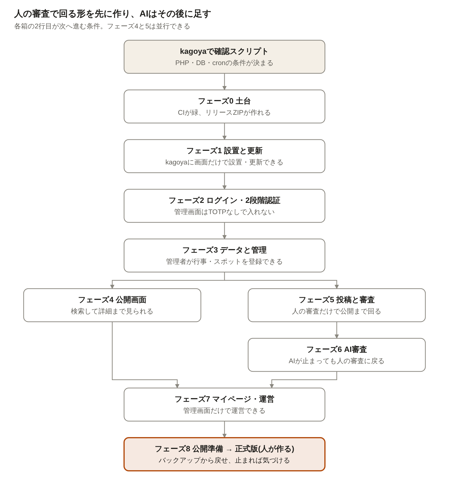

# ド田舎.net 実装指示書

Oct 6, 2026 · @ちょこ

要件定義書・設計書・画面デザインをもとに、Claude Code に渡し、フェーズ0〜8を質問で止まらずに続けて実装してもらうための指示書です(進め方は 3.1)。kagoyaの実機確認は2026-10-08に済み、PHP 8.4・MySQL 8.0.46 で確定しています(2章)。次は フェーズ0 です。

## 1. 前提(バージョン選定)

Laravel 13 を第一候補にします。Laravel 12 はバグ修正が2026年8月13日に終わっていて、セキュリティ修正も2027年2月24日で終わります。kagoyaで PHP 8.4 が使えると確認できたので、Laravel 13 で確定です(2026-10-08)。

| 項目 | 第一候補 | 必要な条件 | 条件を満たせないとき |
| --- | --- | --- | --- |
| フレームワーク | Laravel 13.x(セキュリティ修正は2028年3月17日まで) | PHP 8.3〜8.5 | —(PHP 8.4 で確定) |
| PHP | 8.4(kagoyaは 8.4.26 で確認済み) | 拡張機能は2章の表を参照 | 足りない拡張は2章の代わりの方法で補う |
| データベース | MySQL 8.0.46(kagoyaで確認済み) | ngram全文検索、照合順序 utf8mb4\_ja\_0900\_as\_cs\_ks | —(MySQL 8.0.46 で確定) |
| 品質の道具 | Pest、Playwright(E2E)、Larastan(レベル max)、Laravel Pint | GitHub Actionsで毎回実行 | — |
| 開発環境 | Docker(本番と同じPHP・DBのバージョン) | 2章の確認結果に合わせる | — |

ライブラリのバージョンはフェーズ0で composer.lock に固定し、リリースZIPには vendor を同梱します(kagoyaで composer を動かさない前提)。

## 2. kagoya実機確認

確認スクリプト doinaka-check.php をkagoyaに置いて開くと、下の表の項目を自動で判定します。結果は「結果のテキスト」をコピーして共有してください。コントロールパネルでしか分からない項目は、表の下のチェックリストで確認します。

1. ファイル先頭の ACCESS\_KEY に20文字以上の推測されにくい文字列を入れる
2. 公開ディレクトリにアップロードし、`/doinaka-check.php?key=(ACCESS_KEY)` を開く
3. cronに `php (絶対パス)/doinaka-check.php --cron` を1分おきで登録し、5分ほど待って再読み込み
4. DBの接続情報を入れて「DBを確認」を押す(入力値は保存しない)
5. 「結果のテキスト」をコピーして共有する
6. スクリプト、dkcheck フォルダ、doinaka-check-cron.log、cronの登録を削除する

| 確認項目 | 合格の条件 | ダメなときの代わり |
| --- | --- | --- |
| PHPのバージョン(Webとcronの両方) | 8.3以上。Webとcronで同じ | 8.2ならLaravel 12。cronだけ古いときはPHPをフルパスで指定 |
| 必須の拡張機能(mbstring、pdo\_mysql、fileinfo、openssl、curl など) | すべてある | 無いと動かない。サーバーの変更を検討 |
| WebPの書き出し(GDかImagick) | どちらかでできる | できなければJPEGで保存するよう画像設計を変える |
| HEICの読み込み(Imagick) | 読めれば受け付ける | 投稿画面でHEICを断り、端末側でJPEGにしてもらう(設計書12.3) |
| upload\_max\_filesize | 10MB以上 | .user.ini かコントロールパネルで上げる |
| post\_max\_size | 110MB以上(記事10枚×10MB) | 画像を1枚ずつ先に送る方式にする |
| memory\_limit | 256MB以上 | 変換をImagickにして、画像の大きさを先に縮める |
| symlink関数 | 使える | storage:link の代わりに、画像を public 配下に直接保存する |
| 外部通信(OpenRouter、Google、Turnstile、GitHub) | どれもHTTP 2xxか3xx | 届かない先の機能は使えないので、kagoyaに問い合わせる |
| cronの実行間隔 | 60秒前後で毎分動く | 5分おきなら、キューの待ち時間が伸びる前提で設計を続ける |
| DBの種類とバージョン | MySQL 8.0以上 | MariaDBなら検索を LIKE 版にする |
| ngram全文検索 | 「獅子舞」で1件ヒット | LIKE 版の SearchEngine |
| 照合順序 utf8mb4\_ja\_0900\_as\_cs\_ks | 使える | utf8mb4\_unicode\_ci |
| DBの権限(CREATE、ALTER、INDEX) | すべてできる | できなければマイグレーションが動かない。DBユーザーの設定を見直す |

コントロールパネルでの確認:

- [ ] ドメインのドキュメントルートを「アプリの public フォルダ」に変えられるか。変えられないなら public の中身だけを公開ディレクトリに置き、本体はその外に置く
- [ ] PHPのバージョンを切り替えられるか(8.3以上の選択肢)
- [ ] cronの最短間隔と登録できる数
- [ ] SSHで入れるか(入れなくても運用できる設計だが、障害時の調査が楽になる)
- [ ] 日本語ドメイン(ド田舎.net)に無料SSLを付けられるか
- [ ] 自動バックアップの対象(ファイルとDBの両方か)、保持日数、戻し方
- [ ] メール送信(SMTP)の設定値。管理者への通知に使う

### 確認結果(2026-10-08)

PHP 8.4.26 で必要な拡張機能はすべてあり、Laravel 13 で確定です。Imagick で WebP と HEIC の両方を扱えるので、HEIC も受け付けます。直すのは php.ini の3点と HTTPS で、まだ確認していないのは cron と DB です。

| 項目 | 結果 | 決定・対応 |
| --- | --- | --- |
| PHP | 8.4.26(apache2handler、64bit) | Laravel 13。Docker も PHP 8.4 に合わせる |
| 拡張機能 | 必須・推奨ともすべてあり | そのまま |
| 画像 | Imagick 6.9.13 で WebP・HEIC・AVIF が使える | HEIC を受け付ける。変換は Imagick で行う |
| memory\_limit | 128MB(注意) | Web は public/.htaccess で 256MB にする。画像変換は cron のキューで `php -d memory_limit=512M` にして動かし、Imagick にもメモリの上限を設定する(下の注) |
| display\_errors | On(注意) | public/.htaccess で Off にする。Laravel 側でも出さない |
| upload\_max\_filesize / post\_max\_size | 25600MB / 1024MB(大きすぎる) | public/.htaccess で 10MB / 110MB に下げ、巨大な送信を PHP の手前で断る |
| 置き場所 | ドキュメントルートは /home/choko1229/public\_html、1つ上に書き込める | 本体を /home/choko1229/doinaka/ に置き、ド田舎.net のドキュメントルートを /home/choko1229/doinaka/public にする |
| HTTPS | 初期ドメイン(http)で確認したため「いいえ」 | ド田舎.net を追加して SSL を設定したあと、本番ドメインで再確認する |
| 外部通信 | OpenRouter・Google・Turnstile・GitHub すべて通る | そのまま |
| cron | 毎分動く(間隔59〜61秒)。実行ユーザーは Web と同じ choko1229、PHP も同じ 8.4.26 | cron の PHP はフルパス /opt/remi/php84/root/usr/bin/php で指定する。ファイルの持ち主がそろうので storage の権限は標準のままでよい |
| DB | MySQL 8.0.46。ngram 全文検索、utf8mb4\_ja\_0900\_as\_cs\_ks、CREATE・ALTER・INDEX の権限すべて OK。サーバーの既定の文字コードは binary、sql\_mode は strict なし、time\_zone は JST | 検索は ngram 版。接続設定で charset utf8mb4、collation utf8mb4\_ja\_0900\_as\_cs\_ks、strict モード、time\_zone +09:00 を明示し、サーバーの既定値に頼らない(下の注) |

注: スマホの写真を Imagick(Q16)で開くと、1200万画素で約93MB、4800万画素で約372MB のメモリを使います。ImageMagick のメモリは PHP の memory\_limit とは別に数えられるため、Imagick 自身の上限も設定し、超えた分はディスクで処理させます。JPEG は読み込み時に縮小する指定を使って、メモリを減らします。

注: DBサーバーの既定の文字コードが binary なので、何も指定せずに作ったテーブルでは日本語の並べ替えや検索がおかしくなります。Laravel の DB 設定とマイグレーションの両方で文字コードと照合順序を指定し、テストで「全テーブルが utf8mb4 になっている」ことも確かめます(フェーズ0)。時刻はアプリもDB接続も日本時間にそろえ、OpenRouter の回数リセット(UTC 0時 = 日本時間 9時)だけコードで UTC を扱います。

注: .htaccess の php\_value / php\_flag が効くことを確認しました(2026-10-08)。memory\_limit 256M、upload\_max\_filesize 10M、post\_max\_size 110M、display\_errors off は、アプリの public/.htaccess に書いてリリースZIPに含めます(フェーズ0)。インストーラーの環境確認でも、これらの値が効いているかを判定します(フェーズ1)。cron の処理には .htaccess が効かないので、cron のコマンドに `-d memory_limit=512M` を付けます。

残りの確認:

- [x] cron を登録して、間隔と実行ユーザーを見る(2026-10-08 完了)
- [x] DB を確認する(2026-10-08 完了)
- [ ] .htaccess の php\_value が効くかを確かめる(2026-10-08 効くことを確認)
- [ ] ド田舎.net の追加、ドキュメントルートの指定、SSL の設定
- [ ] 確認スクリプト、dkcheck フォルダ、doinaka-check-cron.log、cron の登録を削除する

### ドメイン(2026-10-08 追加済み)

本物のURLはド田舎.netに1つにまとめ、do-inaka.net は「入力しやすく、共有しやすい入口」にします。do-inaka.net に来た人は、同じパスのド田舎.net へ301で転送します。ログインのCookieはドメインごとに分かれるので、両方で表示するとログイン状態や検索エンジンの評価が分かれてしまうためです。

| ドメイン | 役割 | 使う場所 |
| --- | --- | --- |
| ド田舎.net(xn--gdkt37rmci.net) | メイン。すべてのページはここで表示する | APP\_URL、canonical、og:url、sitemap.xml、Googleログインのコールバック |
| do-inaka.net | 共有用。同じパスのド田舎.net へ301で転送する | 共有ボタンでコピーするURL、QRコード、チラシ、口頭で伝えるとき |

- 共有用ドメインは settings に保存し、管理画面の「サイト」タブで変えられるようにする
- 転送はアプリのミドルウェアで行う(テストできるため)。do-inaka.net の公開ディレクトリがアプリの public と別の場合は、そこに転送だけを書いた .htaccess を置く
- SSL は両方のドメインに必要(https://do-inaka.net のままでは転送より前に警告が出るため)
- Turnstile には両方のホスト名を登録する。Googleログインのコールバックはメインだけでよい

.htaccess の確認手順: public\_html に dkcheck フォルダを作り、確認スクリプトと次の .htaccess を置いて開きます。memory\_limit などの値が変われば効いています。500 エラーになったら、.htaccess を消してください(上書きが許可されていないという意味です)。確認が終わったら dkcheck フォルダごと削除してください。

```apache
php_value memory_limit 256M
php_value upload_max_filesize 10M
php_value post_max_size 110M
php_flag display_errors off
```

## 3. AIへの渡し方(全フェーズ共通)

フェーズ0から8までを、質問で止まらずに続けて実装します(2026-10-08 決定)。1フェーズにつき PR 1本です。進め方は次の「3.1 ノンストップ実行のルール」に従います。

### 3.1 ノンストップ実行のルール(2026-10-08 決定)

- **進め方**: フェーズ0から8までを続けて実装する。フェーズごとにブランチ(`phase-{番号}-{名前}`)を切り、PR を作り、CI(Pint・Larastan max・Pest)が通ったら自分で squash マージして次のフェーズへ進む。main はブランチ保護で CI の成功を必須にする
- **質問しない**: 仕様の抜け・矛盾・不明点は、各フェーズの最初に洗い出して `docs/decisions.md` に書く。決め方は「設計書 → 要件定義書 → 画面デザイン → 安全で後から戻しやすい方」の順。書く項目は、日付・フェーズ・迷った点・選んだ案・理由・選ばなかった案。PR の本文にも同じものを書く
- **人の手が要る確認**: 実機・本番・外部サービスの管理画面が要る確認(各フェーズの「確認」のうち自動で試せないもの)は、待たずに `docs/manual-checks.md` に「フェーズ・手順・期待する結果」で追記して先へ進む。自動で試せる部分はテストで代える
- **進み具合の記録**: `docs/progress.md` に、今のフェーズ・終わったフェーズと PR 番号・次にやることを、フェーズの区切りと大きな作業の区切りごとに書く(2026-10-09 決定)。会話の要約やセッションの切り替えのあとは、まずここと decisions.md を読んで続きから再開する
- **止まってよいとき**: 次の3つだけ。止まるときは `docs/blocked.md` に理由と試したことを書く。①同じ CI の失敗を3回直しても通らない ②本番や利用者のデータを消す操作が必要になった ③秘密の値がコミットや PR に入りそうになった
- **秘密の値(開発用)**: 人が用意した開発用の本物のキーを `.env.local`(.gitignore 済み。コミットしない)に置き、`php artisan dev:import-secrets`(APP\_ENV=local のときだけ動く)で settings に暗号化して入れる。テストと CI では使わず、外部 API は必ずモックする。値をログ・PR・コミットに出さない
- **リリース**: タグは `v{西暦の下2桁}.{月}.{その月の何回目か}`(例 `v26.10.1`。回数は1から)。ベータも同じ数え方で、GitHub の「プレリリース」にしてリリース名を `【BETA】v26.10.1` にする。Claude Code が作ってよいのはベータだけで、正式版は人が作る。本番は既定で正式版だけを適用する(設定 update.accept\_beta)
- **資料**: リポジトリの `docs/` に置く。requirements.md、design.md、implementation.md、legal.md、design/(画面デザインの HTML)、data/(初期データの CSV と README)
- 言語: コードのコメント、コミットメッセージ、PR、docs/ の記録はすべて日本語。コミットの1行目は「フェーズ3: 行事の編集画面を追加」のように、何をしたかが分かる短い文にする。変数名・クラス名などの識別子は英語(2026-10-08 決定)
- ライセンス: LICENSE ファイルは置かない。README に「Copyright (c) 2026 choko1229. All rights reserved.」と、コードは公開しているが利用・再配布は許可しないことを書く。使うライブラリとフォントのライセンス表示(OFL など)は守る(2026-10-08 決定)
- 開発環境: 運営者の Windows + Docker Desktop(WSL2 バックエンド)。リポジトリは Windows の `C:\Users\choko\Documents\GitHub\DoInaka`(GitHub Desktop で管理。GitHub は choko1229/DoInaka)に置き、Claude Code は Windows で動かす。Windows のフォルダを Docker にマウントすると遅く変更検知も効きにくいため、vendor/ と node_modules/ は Docker の名前付きボリュームに置き、Vite はポーリングで変更を検知する。改行は LF にそろえる(2026-10-08 決定、2026-10-09 置き場所を変更)

### 3.2 走らせる前に人が用意するもの

- `.env.local` に入れる開発用の値: OpenRouter の API キー、Google OAuth のクライアント ID とシークレット(戻り先 `http://localhost:8080/auth/google/callback` を登録)、Discord の開発用チャンネルの Webhook URL。Turnstile は Cloudflare が公開しているテスト用キー、メールは Docker の Mailpit を使う。変数名は `OPENROUTER_API_KEY`、`GOOGLE_CLIENT_ID`、`GOOGLE_CLIENT_SECRET`、`DISCORD_WEBHOOK_URL`(2026-10-09 決定。dev:import-secrets はこの4つだけを読む。空の値は読み飛ばす)
- イラスト64枚の PNG を resources/images/illust/src/ に置く(Git には入れない)
- GitHub の choko1229/doinaka に、Claude Code が push・PR 作成・マージできる権限
- `docs/` に入れる資料(この指示書・設計書・要件定義書・規約・画面デザイン・初期データ)

コードのルール:

- 全ファイルで `declare(strict_types=1)`。引数・戻り値・プロパティに型を付ける
- 状態や種別は enum。文字列の直書きをしない
- 画面の文言はすべて `lang/ja` から出す
- 設定は DB(settings)。.env は設計書14章にある値だけ
- コントローラーは薄く。処理はサービス、外部とのやり取りは差し替え可能なインターフェース(設計書2.2)を通す
- 例外は握りつぶさない。利用者には分かる言葉を出し、ログには原因を残す。個人情報と秘密の値はログに書かない
- 管理操作はすべて操作ログに残す。公開データの変更は revisions に残す
- 外部API(OpenRouter、Google、Turnstile、GitHub、Discord、巡回先のサイト)はテストでは必ずモックする

完了の条件(全フェーズ共通):

- [ ] Pint、Larastan(レベル max)、Pest がすべて通る
- [ ] そのフェーズの「テスト」に書いたケースがすべてある
- [ ] 「レビュー」の観点で自己レビューを2回以上行い、指摘と対応をPRに書く
- [ ] 画面があるフェーズは、デザインのアートボードとPC・スマホ両方で見比べた
- [ ] 設計書と違う実装をしたら、理由と一緒にPRに書き、設計書の更新案を添える

依頼文のひな形(フェーズごとに `{ }` を埋めて貼る):

```markdown
# ド田舎.net 実装(フェーズ0〜8 ノンストップ)

docs/implementation.md の「3.1 ノンストップ実行のルール」に従い、フェーズ0から8までを順に実装してください。

## 読むもの
- docs/requirements.md(要件定義書)、docs/design.md(設計書)、docs/legal.md(規約・ポリシー)
- docs/implementation.md(この指示書)の全体
- docs/design/ の画面デザイン、docs/data/ の初期データ
- docs/decisions.md(これまでの判断。なければ作る)

## 各フェーズの進め方
1. 仕様の抜け・矛盾・不明点を洗い出し、3.1 の決め方で決めて docs/decisions.md に書く(質問で止まらない)
2. ブランチ phase-{番号}-{名前} で、該当フェーズの「実装内容」を実装する
3. 「レビュー」の観点で自己レビューを2回以上行い、指摘と対応を PR に書く
4. 実機・本番が要る「確認」は docs/manual-checks.md に書いて先へ進む
5. 完了の条件をすべて満たしたら PR を作り、CI が通ったら squash マージして次のフェーズへ進む

止まってよいのは 3.1 の3つの場合だけです。止まるときは docs/blocked.md に書いてください。

## 最後に報告すること
- 全フェーズの PR の一覧
- docs/decisions.md と docs/manual-checks.md の要約
```

## 4. 全体の流れ



(図の SVG: `docs/design/diagrams/implementation-phases.svg`)

投稿と審査(フェーズ5)をAI(フェーズ6)より先に作るのは、AIの無料枠が尽きても運営を止めないためです。フェーズ1の時点でkagoyaに置き、以降は各フェーズの終わりに本番でも動かします。

## 5. フェーズ0〜2(土台・設置・ログイン)

### フェーズ0: 土台

この後のすべてのフェーズが乗る仕組みを作ります。画面はまだ作りません。

実装内容:

- Laravel 13 の新規プロジェクトと Docker 環境(PHPとMySQLは2章で確認したバージョンに合わせる。ポートは 8080。メールの確認用に Mailpit を入れる)
- Pint、Larastan(レベル max)、Pest の設定と GitHub Actions(整形・静的解析・テスト)
- settings テーブルと、型付きで読み書きする設定サービス(読み込みはキャッシュし、保存時に消す)
- app\_meta(アプリとDBのバージョン、設置済みかどうか)
- ログのチャネル分け(アプリ、AI、セキュリティ)と、個人情報を伏せる仕組み
- デザインシステム(docs/design-system/。先に OVERRIDES.md)のトークンをCSS変数にし、時間帯(朝・昼・夕・夜)と季節を判定するサービスを作る
- Blade の共通レイアウト(公開側・管理側)と部品(ボタン、イベントカード、空のヘッダー、配色の切り替え)
- フォントはすべて自サーバーから配信する。Fontsource の npm パッケージ(@fontsource/zen-maru-gothic、@fontsource/biz-udpgothic、@fontsource/yomogi、@fontsource/yusei-magic。いずれも OFL-1.1)の、文字範囲ごとに分割された woff2 を Vite でビルドに含める(font-display: swap。投稿の文字にも対応するため「使う文字だけ」にはしない。2026-10-08 決定)。ロゴは SVG。Google Fonts は読み込まない(設計書15.9)
- 404・500・メンテナンス中のエラー画面(デザインの ErrorPC / Error)
- リリースZIPを作るスクリプト(vendor とビルド済みCSS・JSを含め、.env・テスト・開発用ファイルを除く)
- DB接続の設定とマイグレーションで、文字コード utf8mb4・照合順序 utf8mb4\_ja\_0900\_as\_cs\_ks・strict モード・time\_zone +09:00 を明示する(サーバーの既定が binary のため)
- public/.htaccess(php\_value: memory\_limit 256M、upload\_max\_filesize 10M、post\_max\_size 110M、display\_errors Off)
- GitHub リポジトリ choko1229/doinaka は公開。シークレットのプッシュ保護と Dependabot を ON にする
- docs/decisions.md・docs/manual-checks.md・docs/blocked.md のひな形(3.1)。.gitignore に .env.local を入れ、php artisan dev:import-secrets を作る
- イラスト(2026-10-08 変更、2026-10-09 更新): FV と「写真がないときの代わりの画像」に使うイラストは、場所(field / island / mountain / village)× 季節 × 時間帯の64枚。**64枚は作成済み**で、運営者が着手前に 1536×1024 の PNG を resources/images/illust/src/{場所}-{季節}-{時間帯}.png に置く(元は運営者の PC の C:\Users\choko\Pictures\doinaka-illust\raw\。WSL からは /mnt/c/Users/choko/Pictures/doinaka-illust/raw/)。src/ は合計約200MBあるので .gitignore に入れて Git に含めない。php artisan illust:build で wide(上下を切って 1536×512、PC の FV)、card(左右を切って 1200×900、スマホの FV)、card-sm(card を 600×450 に縮小、一覧のカード)の WebP(品質80)を作り、これらはコミットする(リリースZIPとサーバーで画像処理をしないため)。カードは srcset で card-sm と card を出し分ける。季節と時間帯は今の配色に合わせ、場所はページの分類・地域から分かれば合わせ(対応表は設定)、分からなければ4枚からランダム。同じページは1日の中では同じ絵にする(ページ ID と日付から決まる乱数。ページキャッシュと矛盾しないため)。src/ がない環境(CI など)では illust:build は何もせず、コミット済みの WebP をそのまま使う。仕様は docs/illustrations.md、画面での使い方はデザインの IllustGallery と TopPC / Main
- README.md(日本語。動かし方、docs/ の案内、「All rights reserved」の表示)。LICENSE は置かない
- .gitattributes(\* text=auto eol=lf)と .editorconfig。Windows のフォルダに置いたリポジトリで Docker が動くこと(名前付きボリューム、Vite のポーリング)を README に書く

確認:

- [ ] Docker で起動し、トップに仮ページが出る
- [ ] 空のコミットで CI が緑になる
- [ ] リリースZIPを展開し、.env と tests が入っていない

レビュー:

- APP\_DEBUG の既定が false か。秘密の値がリポジトリに入っていないか
- CSS変数の色がデザインシステムの tokens.json(docs/design-system/tokens.json)と一致しているか
- 設定サービスに文字列のキーが散らばっていないか(enum か定数にまとめる)

テスト:

- 設定: 保存すると次の読み込みで新しい値になる。型が違う値は拒否する
- 配色: 時間帯の切り替え時刻ちょうどと1分前、季節の境目の日を判定できる。利用者が「昼固定」「夜固定」を選んだら時刻に関係なくその配色になる
- エラー画面: 存在しないURLで404画面が出る。例外時にスタックトレースが画面に出ない
- DB: マイグレーション後、全テーブルが utf8mb4 / utf8mb4\_ja\_0900\_as\_cs\_ks になっている。接続の time\_zone が +09:00、strict モードが有効
- イラスト: 夏の夕方の島のスポットでは island-summer-evening が選ばれる。場所が分からないページでは4枚のどれかで、同じページ・同じ日なら何度開いても同じ絵。illust:build で wide は 1536×512、card は 1200×900、card-sm は 600×450 になる。src/ がないときは何もせずに正常終了する。WebP がないときは無地の背景色になり、エラーにならない
- dev:import-secrets は APP\_ENV が local 以外では何もせずに終わる。取り込んだ値は暗号化されて settings に入り、ログに出ない

### フェーズ1: インストーラーと自動アップデート

初回だけZIPを置いて画面から設置し、その後はサーバーが自分でGitHubのリリースを確認して更新する状態にします。仕組みは chok.ooo([URL-Shortener](https://github.com/choko1229/URL-Shortener) の app/Services/Update)と同じで、コードを流用して下の「流用元との違い」だけ変えます。

実装内容:

- `/install/`: 動作環境の確認(doinaka-check.php と同じ判定。.htaccess の値が効いているかも見る)→ DB接続 → .env の生成(APP\_KEYを含む、権限600)→ テーブル作成 → サイト情報 → 最初の管理者(設計書5.2)
- 設置キー: 初回アクセス時に公開外の storage にランダムなキーを書き出し、画面でその入力を求める(FTPで見られる人だけが設置できる)。設置後は `/install/` が404
- リリース: v{西暦の下2桁}.{月}.{その月の何回目か} のタグ(例 v26.10.1。3.1)を push すると、GitHub Actions がテスト → 配布用ZIPの作成(vendor・ビルド済みアセット・VERSION・public/.htaccess を含め、.env・tests を除く)→ Release に添付
- 更新の確認: cron の定期処理で1日1回、更新する時間帯のはじめに GitHub Releases の最新を確認する。管理画面の「今すぐ確認」でも確認できる(自動ONのときも、その場では適用せず次の時間帯を待つ)
  - 更新する時間帯の自動判定: 公開ページの閲覧数を1時間ごとに集計し(個人を特定できない件数だけ)、過去28日の時間帯別(日本時間)の平均が最も少ない1時間を選ぶ。毎週月曜に計算し直す。差が10%以内なら、他の重い定期処理(人気スコアの集計、AI枠のリセットの日本時9時)と重ならない方。データが28日分たまるまでは4時台。管理画面で「時刻を指定する」に切り替えもできる
  - 画面は AdminUpdatePC / SP(2026-10-08 作り直し)。ナビの名前は「アップデート」
- 更新の適用: ロック → バックアップ(DBダンプとコード、直近3世代、storage/app/private/backups)→ ZIPのダウンロードと検証 → メンテナンスモード → ディレクトリを丸ごと入れ替え → opcache のリセット → キャッシュ削除 → マイグレーション → ヘルスチェック → メンテナンス解除。失敗したらコードとDBを元に戻す
- 自動適用の ON/OFF: ON なら確認と同時に適用、OFF なら知らせるだけで、管理画面の「今すぐ更新」で適用する
- ヘルスチェック: DB接続、ビルド済みアセット、トップページと検索が表示できること
- 結果を update\_runs に記録し、管理画面と Discord Webhook で知らせる。Webhook URL は暗号化して settings に保存し、ログには出さない。リポジトリは公開なのでGitHubトークンは使わない
- ZIPを手で上書きした場合に備え、更新後の最初のアクセスでもテーブルの変更を適用する(chok.ooo の UpdateDatabaseSchema と同じ)
- APP\_DEBUG が true のときの警告と、cron が5分以上止まったときの表示(設計書10.3)
- 流用元との違い: PHP 8.4 でビルド・テストする。入れ替え中はメンテナンスモードにする。ZIPは GitHub が返す SHA-256(添付ファイルの digest)と照合する。cron は `-d memory_limit=512M` 付き。投稿画像(storage)は更新のバックアップに含めず kagoya の自動バックアップに任せる
- ベータ: GitHub のプレリリース(リリース名【BETA】v26.10.1)は、設定 update.accept\_beta が ON のときだけ更新の対象にする(既定 OFF)。管理画面のアップデートでは、ベータに【BETA】を付けて表示する(2026-10-08 決定)

確認:

- [ ] kagoyaにリリースZIPを置き、画面だけで設置が終わる
- [ ] テスト用のタグを出し、「今すぐ確認」→更新が届き、次の定期処理で自動で更新される
- [ ] わざと失敗するマイグレーションを含むリリースで、元の版に自動で戻り、Discord に通知が来る

レビュー:

- 設置済みの状態で `/install/` に入れる道がないか。.env に書く値の改行や引用符で設定を注入できないか
- ZIPの中に `../` を含むパスや絶対パスがあっても、アプリの外に書き出さないか
- Web と cron が同時に更新しようとしてもロックで1つになるか。途中で止まってもメンテナンスモードが残り続けないか
- トークンや Webhook URL がログや画面に出ていないか

テスト:

- 設置キーが違うと先に進めない。DB接続に失敗したら理由が出て .env は作られない。設置後は `/install/` が404
- バージョンの比較: v26.10.1 < v26.10.2 < v26.11.1(各部分を数として比べるので v26.10.10 は v26.10.9 より新しい)。プレリリースは accept\_beta が OFF なら無視し、ON なら対象にする。形式の違うタグでは更新しない。最新なら何もしない
- 自動適用 OFF のときは確認だけで適用しない
- ZIPでないデータ、SHA-256 の不一致、artisan や vendor の欠けたZIPでは、何も入れ替えず元の版のまま
- マイグレーションやヘルスチェックが失敗すると、コードとDBが戻り、update\_runs が「戻した」になる。メンテナンスモードは解除されている
- バックアップが3世代を超えると古いものから消える
- 時間帯(設計書10.4): 28日分の時間別閲覧数から最も少ない1時間を選ぶ。28日に満たなければ4時。最少との差が10%以内なら毎日のcronと重ならない時刻を選ぶ。管理者の閲覧は数えない。巡回はその1時間前になる
- 管理者以外は更新の画面と「今すぐ更新」を使えない

### フェーズ2: ログインと2段階認証

会員も管理者もGoogleでログインでき、管理画面には2段階認証(TOTP)を通らないと入れない状態にします。画面は LoginPC / SPと AdminLoginPC / SP です。

実装内容:

- Googleログイン(Laravel Socialite)。初回ログインで会員を作る。受け取るのは名前とメールだけ(メールは管理者だけが見る。公開ページ・API・ログには出さない)
- 最初に Google Cloud の OAuth クライアントへ、戻り先URLを Punycode 表記(https://xn--gdkt37rmci.net/…)で登録し、実際にログインできるか確かめる。できない場合は共有用の do-inaka.net でログインして戻す代わりの方法を検討する(設計書16章)
- ロール(users の role 列、enum)と権限(設計書5.3の Permission)。停止中の会員はログインと閲覧・マイページ・退会はできるが、投稿・情報提供・コメント・反応はできない(設計書5.1)
- TOTP: 初回設定(QRコードと手入力用のキー)、コード入力、回復コード8個(ハッシュで保存、1回限り)
- 「この端末を45日間覚える」(設定 admin.remember\_device\_days): DBに保存したトークンと署名付きCookie。TOTPを設定し直したら全端末を無効にする
- 5回間違えたら15分ロック。ログインの成功と失敗をセキュリティログに残す
- 管理画面のミドルウェア: ログイン済み + 管理者 + このセッションでTOTP通過済み
- GoogleのコールバックURLは Punycode(xn--)のドメインで登録する
- コールバックURLは https://xn--gdkt37rmci.net/... の1つだけ。do-inaka.net からログインを始めても、先にメインへ転送されているのでセッションは分かれない

確認:

- [ ] 本番ドメインでGoogleログインが通る(Punycodeのコールバック)
- [ ] スマホの認証アプリでQRを読んで、コードが通る
- [ ] 回復コードで入れ、同じコードが2回目は使えない

レビュー:

- TOTPの秘密鍵は暗号化して保存しているか。コードの比較は時間一定か。同じコードの使い回しを拒むか
- ログイン前後でセッションIDを作り直しているか。ログイン後の戻り先が外部サイトに飛ばないか
- 管理者でない人に「管理画面があること」を必要以上に見せていないか

テスト:

- 初回のGoogleログインで会員ができ、2回目は同じ会員になる。停止中はログインできるが、投稿・コメント・反応は403になる
- 会員(管理者でない)は `/admin` に入れない
- TOTP未設定の管理者は設定画面へ、設定済みはコード入力へ進む
- 5回間違えるとロックし、15分後に解除される
- 端末を覚えた場合は45日間コード不要、46日目とTOTP設定し直し後は必要

## 6. フェーズ3〜5(データ・公開画面・投稿)

### フェーズ3: データと管理のコンテンツ

設計書3章のテーブルをすべて作り、管理者が手で行事・スポット・記事を登録できる状態にします。公開画面より先に作るのは、中身がないと画面を確かめられないからです。

実装内容:

- マイグレーション(地域・分類、event\_series → events → event\_schedules、スポット、記事、画像、情報元、revisions、コメント、お気に入り、行った!、submissions など)
- 初期データ: 全47都道府県と全市区町村1,741(docs/data/municipalities\_jp.csv。総務省の全国地方公共団体コード R6.1.1 現在。is\_northern\_territory=1 の6村と政令指定都市の区は入れない)。香川県の旧町村184(docs/data/kagawa\_former\_municipalities.csv。平成の大合併前34・昭和の大合併前150。era をタグとして持ち、ページに「平成の合併前」「昭和の合併前」と出す。昭和の旧村は parent\_former\_id で平成の旧町の下に並べる。区域が分かれた4村は先頭の市町を親にし、also\_ 列の市町のページにも載せる)。投稿の受付は全県ON、巡回は香川県だけON。分類、タグ
- モデルに enum と型の変換を付ける。画像・情報元・履歴・コメントなどはポリモーフィック
- 変更履歴のサービス: 公開データを変えるときは必ずここを通し、前後の差分を revisions に残す。「この版に戻す」もここで行う
- 管理画面: マスタ(AdminMasters)、行事・開催回(AdminEvents)、スポット・記事・コメント(AdminContents)、各編集フォーム、履歴
- 開催回の「中止にする」(消さずに表示だけ変える)、日付を変えたら「延期」、「去年の回をコピーして来年分を作る」
- 検索用の search\_text 列を保存時に更新する
- 開発用の見本データ(DemoSeeder。2026-10-08 決定): 架空の行事・スポット・記事を20件ずつ。地名だけ実在のものを使い、行事名・団体名・人名は架空にする。画面の見比べと E2E テストに使う。APP\_ENV が local または testing のときだけ入れられ、本番では動かない

確認:

- [ ] 管理画面から行事・開催回・スポット・記事を各数件登録できる(公開画面の確認用データにもなる)
- [ ] 編集すると履歴が増え、古い版に戻せる

レビュー:

- 検索と並べ替えに必要なインデックス(ngram全文、緯度経度、開催日時、人気スコア)があるか
- 外部キーと削除時の動きが意図どおりか(使われているマスタは消せない)
- 一覧画面で N+1 クエリが起きていないか

テスト:

- 更新で revisions が1件増え、戻すと内容が元になる(戻したことも履歴に残る)
- 中止した開催回は残り、公開側で「中止」と表示される。日付を変えると「延期」になる
- 来年分のコピーで日付が1年進む(うるう年の2月29日を含む)
- 使われている分類は削除できない
- 初期データ: 市区町村が1,741件入り、北方領土の6村と政令市の区は入らない。香川の旧町村が184件(平成34・昭和150)入り、昭和の旧村が親の平成の旧町の下に出る。川津村は坂出市のページと宇多津町のページの両方に出る
- 見本データ: local で行事・スポット・記事が20件ずつ入る。production では実行しても何も入らず、理由を表示して終わる

### フェーズ4: 公開画面

デザインの公開側の行(トップから404まで)を実装し、検索とおすすめを動かします。

実装内容:

- 設計書6.1のルート(URLの先頭に県のスラッグ)。有効でない県は404
- トップ、イベント一覧・検索、イベント詳細、スポット詳細、記事、地図、404(PCとスマホのアートボードどおり)
- 検索: SearchEngine の ngram 版(MariaDBなら LIKE 版)、日付の絞り込み(今日・今週末など。今週末は祝日・連休を含む。内閣府の祝日CSVを週に1回 holidays テーブルへ取り込む。設計書11.2)、距離(緯度経度の四角で絞ってから距離を計算)
- 人気スコアを1時間ごとに集計(閲覧×1 + お気に入り×5 + 行った!×3、直近30日)。関連・近くの情報(設計書11.5)
- 地図: Leaflet をビルドに含める。地理院タイル。夜の配色ではタイルを暗くする
- `/api/v1`: 絞り込みの部分更新、お気に入り、行った!(ログインが必要なものは未ログインでログイン画面へ)
- 配色の切り替え(自動・昼固定・夜固定)をCookieで覚える
- SEO(設計書15章): ページごとのタイトルと説明、OGP、構造化データ(JSON-LD)、種類別のサイトマップインデックス、robots.txt、canonical。掲載が5件未満の一覧・クエリ付きの絞り込み・検索結果は noindex, follow。固定の絞り込みページ(今週末・カテゴリ別)
- ドメイン: do-inaka.net から同じパス・クエリのド田舎.net へ301転送。共有ボタンとQRコードは do-inaka.net のURLを作る。canonical・og:url・sitemap はメイン
- 地域ページ(設計書9.8): `/{pref}/`、`/{pref}/{city}/`、`/{pref}/{city}/{old}/`。基本情報、紹介文(まだなければ「準備中」)、次の階層の一覧、その地域のイベント・スポット、出典。初回アクセスで生成キューへ。ファクトチェック済みで出典2件以上の紹介文ができるまで noindex。設置の最後に47都道府県と香川17市町・旧町村を生成キューへ入れる。県ページの画面は PrefPC / PrefSP
- 管理者バー(設計書6.5): TOTP確認済みの管理者が公開ページを見ると上端に出る帯(WordPressの管理バーのようなもの)。公開ページのHTMLには入れず、表示後に /admin/bar?url=… を読み込んで差し込む(ページキャッシュに混ざらない)。管理画面へのリンク、審査・修正依頼の件数、＋新規、今日のAI使用回数と、そのページの操作(イベント: 編集・情報元を読み直す・中止・非公開・履歴。地域ページ: 紹介文を再生成・編集・履歴・検索への公開)。変更はPOSTとCSRFトークン。画面は EventDetailPC / RegionPC の「見ている人: 管理者」
- 海外からのアクセス制限(2026-10-08 決定。設定 geo.block\_overseas、既定 ON): 日本の IP アドレス(APNIC の delegated-apnic-latest で国が JP の IPv4・IPv6)以外からは 403 と「海外からはご利用いただけません」の画面(BlockedPC / SP)を出す。例外は、検索エンジンのクローラー(Googlebot、AdsBot-Google、Mediapartners-Google、bingbot。逆引きと正引きで本物か確かめる)、robots.txt・サイトマップ、利用規約・プライバシーポリシー・運営者情報・お問い合わせ(海外の権利者からの削除依頼を受けるため)。一覧は週1回 cron で取り直し、取れなければ前の一覧を使う。一覧が空のときは制限しない(全員を締め出さないため)。管理画面も海外からは入れない(設定 geo.allow\_admin\_abroad、既定 OFF)

確認:

- [ ] 各画面をPC(1280幅)とスマホ(390幅)で開き、アートボードと見比べる
- [ ] 朝・昼・夕・夜と四季を切り替えて、文字が読める
- [ ] schema.org の検証で Event の構造化データにエラーがない(日本ではイベントのリッチリザルトは表示されない)

レビュー:

- 投稿由来の文字をすべてエスケープしているか(本文の改行やリンクも含む)
- 検索条件の入力を検証しているか(範囲外の距離、不正な日付)
- 押せるものが44px以上、キーボードで操作でき、フォーカスが見えるか
- 重いクエリにキャッシュがあるか(トップの「今週末」など)

テスト:

- 「獅子舞」で獅子舞の行事が出て、関係ないものは出ない
- 「今週末」は土日と、つながる祝日・振替休日を含む(金曜祝日、月曜振替、GW、連休の途中、金曜の夜と日曜の深夜の境目を含む)。祝日CSVのShift\_JISを正しく読める
- 半径10kmで、四角の角にある10kmより遠い場所が除かれる
- 人気スコアの計算が重みどおり、31日前の反応は数えない
- ありえない県のURL、非公開の行事は404
- E2E(Playwright): トップ → 検索 → 詳細 → 行った!(ログイン誘導)をPCとスマホの幅で
- ドメイン: do-inaka.net/kagawa/... が同じパスのド田舎.net へ301で飛ぶ(クエリも残る)。共有ボタンのURLが do-inaka.net になる。canonical がメインを指す。知らないホスト名では転送しない
- 地域ページ: 予約語と同じスラッグは作れない。同じ県で読みが重なると -shi / -cho が付く。存在しない市町・旧町村は404。紹介文なしのページは noindex でサイトマップにも入らない。同じページへ何度アクセスしても生成キューには1つだけ
- SEO: 掲載4件の一覧は noindex でサイトマップになく、5件になると index になり入る。?date= 付きは noindex で canonical が条件なしのURL。do-inaka.net、http、末尾スラッシュなしからは1回の301で正規URLに着く。誤登録で消したイベントは410
- 管理者バー: 一般の人・会員・TOTP未確認の管理者には出ない。キャッシュされた公開ページのHTMLに管理者の情報が入っていない。CSRFトークンのない変更操作は拒否される。管理者の閲覧はページビューに数えない
- 海外制限: 日本の IP は通り、米国の IP は 403。Googlebot を名乗るが逆引きが googlebot.com でないものは 403、本物は通る。海外からでも /terms/ /privacy/ /about/ /contact/ と robots.txt は開ける。一覧の取得に失敗しても前の一覧で動き、一覧が空なら誰も止めない。IPv6 も判定できる

### フェーズ5: 投稿・画像・審査(人の手)

匿名でも投稿でき、管理者が審査して公開する流れを、AIなしで先に完成させます。AIが止まってもこの流れで運用できるようにするためです。

実装内容:

- 投稿(`/post/`)、修正依頼(`/report/`)、コメント。Turnstile、同じIPから1時間5件まで、本文のURLは3個まで、IPはハッシュで90日保存
- (注)このフェーズの「投稿」はスポット・体験談とイベントの写真を指す。イベントは情報提供に変えた(下)
- submissions にJSONで保存し、受付番号を返す。状態の変更は設計書8章のサービスだけが行う
- 投稿は全国から受け付ける。フォームで都道府県 → 市区町村を選ぶ(地図で場所を指したら候補を自動で入れる)。初期値は香川県
- イベントは投稿で作らない(設計書9.7): 「イベントの情報提供」フォーム(情報元のURLかチラシ・回覧板の写真が必須、地域とひとことは任意)。このフェーズでは、管理者が送られたURLや写真を見て手で下書きを作る(写真は個人情報を隠してから)。URLのAI読み取りはフェーズ6で足す。審査画面は AdminTipsPC / SP(管理メニュー「情報提供」)。スポットと体験談は従来の投稿のまま
- イベントの写真は「行った!」と一緒に投稿し、審査後にイベントに加える
- event\_sources テーブル。情報元が0件のイベントは公開できない(モデルの検証とDBの両方で守る)。イベント詳細のタイトル下に情報元を大きく表示する
- 画像: 受付時の検証(形式、10MB、枚数)→ 元画像を公開外に60日保存 → キューで向きを直し、位置情報を含むメタデータをすべて落とし、WebPの1600・800・400pxを作る(拡大しない)
- HEICを受け付ける(Imagickで変換。メモリ上限を超える大きな写真は失敗にして縮小を案内する)
- 管理画面: 審査(AdminReview)、修正依頼(AdminCorrections)、却下ボックス(AdminRejected)。承認で公開テーブルにコピーし履歴を残す
- 定期処理: 却下は90日、元画像は60日で削除
- 同意(2026-10-08 決定): 投稿・情報提供・会員登録(Google ログインのボタンの近く)の送信ボタンのすぐ近くに「利用規約とプライバシーポリシーに同意して送信します」と両ページへのリンクを出す(民法548条の2)。投稿と情報提供には、AIで確認するため外国の事業者に送ることへの同意のチェックボックスも置き(個人情報保護法28条。プライバシーポリシー5へのリンク付き)、チェックしないと送れない。同意した日時と規約・ポリシーの版を submissions に残す

確認:

- [ ] iPhoneとAndroidの実機で、写真付きで投稿できる
- [ ] 公開された画像を保存して、位置情報が残っていない(exiftool で確認)
- [ ] 承認した投稿が公開画面に出る

レビュー:

- アップロード: 拡張子ではなく中身で形式を判定しているか。ファイル名はランダムか。保存先でPHPが実行されないか
- 状態の変更をサービス以外から行っている箇所がないか
- 画面やログにIPアドレスそのものやメールアドレスが出ていないか

テスト:

- 同じIPの6件目、Turnstile失敗、URL4個、画像10MB超、枚数超過は、理由を示して断る
- 情報提供: URLも写真もないと送れない。SNSのURLは理由を示して断る。robots.txt で禁止されたURLは読まず、管理者の確認に回る。香川県外のURLも読むが、定期巡回には入らず候補になる
- 情報元が0件のイベントを公開しようとすると失敗する(管理画面からも、コードから直接でも)
- チラシ写真は「隠したあとの画像」だけが公開され、元の画像は公開外にある
- 画像の変換後にEXIFが残らず、3サイズができる。小さい画像は拡大されない
- 承認 → 公開テーブルと revisions に入る。却下 → 却下ボックス。「元に戻す」→ 審査待ち(公開はされない)
- 91日前の却下と61日前の元画像が定期処理で消える。前日のものは消えない
- 同意: 外国の事業者に送ることへのチェックがないと投稿・情報提供は送れず、理由が出る。送った投稿に同意の日時と版が残る

## 7. フェーズ6〜8(AI・会員と運営・公開準備)

### フェーズ6: AI審査とAI下書き

フェーズ5の人の審査に、AIによる自動承認・自動却下・整形を足します。AIが失敗したときは、必ず人の審査に回します。

実装内容:

- OpenRouter の接続を AI のインターフェースの裏に置く。使えるのは無料(:free)モデルだけで、有料モデルは設定の保存時に断る
- 用途: 投稿の判定・整形、画像チェック(無料モデルがあれば)、URLから下書き(AdminDraft)、ローマ字スラッグ、情報提供のURLの読み取り(AdminTips の下書きを自動で作る)、巡回の解析、地域ページの紹介文とファクトチェック
- 回数の管理: 上限は決めず、OpenRouterの無料枠で制限エラー(429など)が返るまで使う(2026-10-08 決定)。エラー後のジョブは失敗にせず、翌日(UTC 0時)のリセット後に「管理者の操作 → 投稿の判定 → 情報提供の読み取り → 巡回 → 地域ページの紹介文」の優先順で再開する。管理者の操作だけは画面からすぐ再試行できる。毎分20回を超えたら待つ
- 情報源の巡回(設計書9.6): crawl\_enabled が ON の県(初期値は香川県のみ)の情報源を1日1回巡回し、変わったページだけAIで解析して下書きとして審査に回す。robots.txt を守り、同じサイトは10秒以上あける。頻度の自動調整、候補の収集、信頼済みの自動公開、3回失敗で一時停止も含む(設計書9.6の表)。画面は AdminSourcesPC / SP(管理メニュー「情報源の巡回」)
- 地域ページの紹介文(設計書9.8): 情報元の収集 → 下書き(段落ごとに出典番号)→ 別の呼び出しでファクトチェック(裏付けのない文を削除)→ 公開。AIを使う順番は最後で、ほかのジョブが空いているときに作る。管理画面(AdminRegions)と管理者バーの「再生成」で生成キューの先頭に入れられ、新しい紹介文が確認を通るまで今の紹介文を出し続ける(古いものは履歴から戻せる)。修正の受付は AI が情報元と照合して自動で直し、裏付けがなければ管理者へ
- テスト(地域ページ): ファクトチェックで裏付けのない文が消える。残りが少なすぎると公開されない。制限エラー中は生成せず、リセット後に優先順の最後で再開する。裏付けのない修正は自動で反映されない
- 自動承認: 承認実績5件以上かつスコア0.9以上(投稿・コメント・修正依頼。修正依頼は情報元URLも必要)。自動却下: スコア0.05以下で、会員でない人の投稿だけ。運用を始めてから14日間(設定 review.auto\_reject\_shadow\_days)は却下せず「却下するはずだった」と記録だけ残す。どちらも設定画面で変えられる(2026-10-08 決定)
- AIが自動で反映した修正は「要確認」として修正依頼の画面に残す
- AIの呼び出しログ(90日)。ダッシュボードに今日の回数を出す
- 画像を読める無料モデルがないとき(2026-10-08 決定): 文章だけで判定する。写真付きの投稿は、会員で承認実績5件以上、スコア0.95以上、人物・子ども・住所・車のナンバーなどの注意フラグなし、のすべてを満たすときだけ自動承認し、1つでも当てはまらなければ人の審査に回す
- 削除依頼の照合(takedown\_check)は、OpenRouter のリクエストで provider.data\_collection を deny にし、記録・学習しない提供元だけに送る。ほかの用途は、学習に使う無料の提供元も使う(個人情報保護法28条はフォームの同意で対応。2026-10-08 決定)
- モデルの選び方(2026-10-08 決定): 管理画面で用途ごと(文章・画像)に第1候補と予備を選ぶ。候補は OpenRouter のモデル一覧(/api/v1/models)から「:free」だけを出す(1日1回取り直して保存)。選んだモデルが一覧から消えたり、存在しないエラーが返ったら予備に切り替え、Discord に1回通知する。予備もなければ人の審査に回す
- 巡回の User-Agent は「DoinakaBot/1.0 (+https://do-inaka.net/about/)」(2026-10-08 決定)。robots.txt はこの名前と \* の両方で判定する。運営者情報に巡回を止める方法(お問い合わせか robots.txt)を書く

確認:

- [ ] 本物のAPIキーで、投稿1件が判定され、ログと回数が増える
- [ ] APIキーをわざと壊し、投稿が人の審査に回る

レビュー:

- AIにIP・メールアドレス・会員名を送っていないか
- 投稿文は「データ」として渡し、投稿文の中の指示で判定が変わらないか(プロンプトインジェクション)
- AIの返答を決めた形(JSON)で検証し、形が違えば人の審査に回しているか
- タイムアウトと再試行の回数が決まっているか

テスト(AIはすべてモック):

- 境目: 実績4件、スコア0.89は人の審査。実績5件でスコア0.90は自動承認。情報元URLのない修正依頼は人の審査
- 境目: スコア0.05は自動却下、0.06は人の審査。会員の投稿は0.01でも人の審査。運用開始から14日間は却下されず、記録だけ残る
- 制限エラー(テストでは429を返すモック)が出ると、以降のジョブは失敗にならず翌日に回る。管理者の操作は画面から再試行できる。リセット後は優先順(管理者 → 判定 → 情報提供 → 巡回 → 紹介文)で再開し、今日の使用回数の表示はUTC 0時で0に戻る
- 巡回: robots.txt で禁止されたページと、crawl\_enabled が OFF の県の情報源は取得しない。内容が変わらないページでAIを呼ばない。既存の行事と同じものは修正依頼になる。信頼済みでない情報源から取り込んだものは自動で公開されない
- 巡回の頻度: 変化なしが続くと1→2→4→7日おきになり、変化があれば1日に戻る。今日から1年より先と終わった行事は取り込まない
- 信頼済み: 修正なし承認が10件続くと提案が出る。自動公開でも、確信度0.89・既存との食い違い・中止の知らせは人の審査に回る。自動公開を管理者が直すと信頼済みが外れる
- 壊れたとき: 3回続けて失敗(または前回あったのに0件)で一時停止し、通知が1回だけ出る
- 再生成: 押すと生成キューの先頭に入る。新しい紹介文がファクトチェックで不合格なら今の紹介文のまま変わらない。合格したら差し替わり、古いものを履歴から戻せる
- 壊れたJSON、タイムアウト、429 のとき、投稿が失われず人の審査か再試行になる
- 有料モデルを設定しようとすると保存できない
- 画像モデルなし: 写真付きでスコア0.94、または注意フラグが1つでもあれば人の審査。条件をすべて満たせば自動承認
- takedown\_check のリクエストには必ず data\_collection: deny が入る
- モデルの切り替え: 第1候補が一覧から消えると予備で動き、Discord の通知は1回だけ。予備もないと人の審査に回る。候補の一覧に :free 以外は出ない
- 巡回: リクエストの User-Agent が DoinakaBot/1.0 で始まる。robots.txt で DoinakaBot だけ禁止されているサイトを読まない

### フェーズ7: マイページ・会員・広告・ログ・設定

残りの画面を仕上げ、管理者が管理画面だけで運営できる状態にします。

実装内容:

- マイページ: お気に入り、行った!、自分の投稿と審査の結果、配色の設定
- 会員(AdminUsers): 一覧、停止と解除、権限の変更。メールアドレスは詳細画面でだけ表示し、表示を操作ログに残す
- 広告枠(AdminAds): AdSenseの場所ごとのON/OFF(地図・投稿・マイページには出さない)、期間付きのPR枠(必ず「PR」と表示)
- ログ(AdminLogs): 操作・審査・AI・エラー、絞り込み、CSV書き出し
- 設定(AdminSettings)の全タブと、ダッシュボードの数字
- AdSense は Google の広告だけを出す。Google 以外の広告配信事業者を AdSense の管理画面で無効にすることを manual-checks に書く(2026-10-08 決定)

確認:

- [ ] 管理画面の全画面をPCとスマホで開き、アートボードと見比べる
- [ ] PR枠を期間付きで入れ、期間が過ぎると消える

レビュー:

- CSVの先頭が `=` `+` `-` `@` のセルを無害化しているか(表計算ソフトでの式の実行を防ぐ)
- 自分自身の管理者権限を外して、管理者が0人にならないか
- 設定の変更と会員の停止がすべて操作ログに残るか

テスト:

- 停止した会員はログイン・閲覧・マイページ・退会はできるが、投稿・情報提供・コメント・反応は403になる。それまでの投稿は残る(設計書5.1)
- 最後の管理者の権限は外せない
- PR枠は開始前・終了後に表示されない。AdSenseは地図・投稿・マイページに出ない
- CSVの式になる文字が無害化される

### フェーズ8: 公開前の運用準備

「壊れても気づけて、戻せる」状態にしてから v1.0.0 を出します。

実装内容:

- 定期処理(設計書10.2)がすべて登録されているかの点検。cronが止まったら Discord に通知(止まったときと回復したとき。設計書10.3)
- 利用規約・プライバシーポリシー・運営者情報・お問い合わせのページと、管理画面のお問い合わせ(設計書6.6。画面は LegalPC / SP、AboutPC / SP、ContactPC / SP、AdminInquiriesPC / SP。文面は「利用規約・プライバシーポリシーほか(下書き)」)。全ページのフッターからつなぐ
- セキュリティヘッダー(CSP、HSTS など)と robots.txt
- 両方のドメインでSSL証明書が有効で、http で来ても https のメインに着くこと(転送は1回で済ませる)
- Search Console へのサイトマップ登録、GA4
- メールの送信(2026-10-08 決定): 送信元は contact@do-inaka.net(kagoya のメール)。SMTP の接続情報は settings に暗号化して保存する(mail.\*)。管理画面のお問い合わせに返信フォームを作り、削除依頼の結果の通知もここから送る。送信はキューで行い、失敗したら3回まで再試行して管理画面に出す。本文とアドレスはログに出さない。開発では Mailpit に送る。SPF・DKIM の設定を manual-checks に書く
- 同意バナー(2026-10-08 決定。海外からは使えないので日本向けの簡易版): 初めて来た人に下部の帯で「アクセス解析と広告に Cookie を使います」と出し、「同意する」「拒否する」を選べる。選ぶまでは Google の同意モード v2 で拒否として扱い、選んだ結果を Cookie で1年覚える。フッターの「Cookie の設定」から変えられる
- 削除への同意照会(2026-10-08 決定。情報流通プラットフォーム対処法3条2項2号): 削除依頼の対象が会員の投稿なら、マイページに通知を出し、依頼の内容(依頼者の情報は除く)を示して「削除に同意する / 反対する(理由)」を聞く。7日(設定 takedown.objection\_days)たっても反対がなければ管理画面に「削除できる」と出す。削除は管理者が押したときだけ。その間もぼかしは続ける
- お問い合わせのフォームにも、規約への同意の表示と、外国の事業者に送ることへの同意のチェックボックスを置く(フェーズ5と同じ)

確認:

- [ ] kagoyaの自動バックアップから、ファイルとDBを実際に戻せる(戻しの練習)
- [ ] cronを止めて、Discord に通知が届き、再開すると回復の通知が届く
- [ ] 本番で APP\_DEBUG=false、`/install/` が404、doinaka-check.php、dkcheck フォルダ、doinaka-check-cron.log、確認用の cron 登録が消えている
- [ ] お問い合わせ: 種類ごとの必須項目(削除依頼はURLと権利、広告と個人情報はメール)が守られる。削除依頼を送ると、対象がぼかされ「確認中」と出るが、削除されない。ぼかしたページのHTMLや画像URLから元の内容が読めない。AIの照合結果が管理画面に出て、削除は管理者が押したときだけ起きる。プライバシーと肖像権の依頼は Discord に「急ぎ」で届く。Discord の通知に内容とメールが入っていない。プライバシーポリシーの外部送信の表と、実際に読み込んでいる外部サービスが一致する

レビュー:

- この指示書と設計書13章のセキュリティ対策を、別のAI(実装していないもの)に照合させる

テスト:

- 本番と同じ設定でE2Eを全部通す(投稿 → AI判定 → 審査 → 公開 → 検索で見つかる)
- セキュリティヘッダーが全ページに付いている
- メール: 返信フォームから送ると Mailpit に届き、送信元が contact@do-inaka.net。SMTP が失敗すると3回再試行して管理画面に出る。ログに本文とアドレスがない
- 同意バナー: 選ぶ前は GA4 と広告の Cookie が作られない。拒否すると GA4 は動かず、広告はパーソナライズなしになる。同意すると両方動く
- 同意照会: 会員の投稿に削除依頼が来るとマイページに通知が出る。6日目は「削除できる」にならず、7日たって反対がなければなる。反対すると理由が管理画面に出る。どの場合も自動では消えない。匿名の投稿には照会しない

## 8. 未決事項と出典

各フェーズに入る前に決めるものです。括弧内が、決める期限になるフェーズです。

- [ ] 決定済み: Laravel 13、PHP 8.4、MySQL 8.0.46、ngram 検索(2026-10-08)
- [ ] 決定済み: リポジトリは choko1229/doinaka。公開。シークレットのプッシュ保護をONにする(2026-10-08)
- [ ] 決定済み: 自動更新ON + 手動更新あり。時間帯はアクセスが少ない時間を自動判定。画面も作り直し済み(2026-10-08)
- [ ] 決定済み: Larastan のレベルは最初から max(2026-10-08)
- [ ] 決定済み: 「この端末を覚える」は45日(2026-10-08)
- [ ] 決定済み: ローマ字変換は自前のカナ→ヘボン式(外部ライブラリは使わない。設計書9.5。変換表のテストを付ける)
- [ ] 決定済み: 管理側の編集フォームは、先に画面デザインを作ってから組む(フェーズ3の前に用意)
- [ ] 決定済み: 「今週末」に祝日・連休を含める(設計書11.2)
- [ ] 決定済み: HEIC を受け付ける(Imagick で変換できることを確認)
- [ ] 決定済み: 人が却下した投稿を90日で物理削除する
- [ ] 決定済み: コメントは通報3件で自動非公開(設定 comment.auto\_hide\_reports)
- [ ] 自動却下の基準は 0.05、会員は対象外、最初の14日は判定だけ記録(2026-10-08 決定)。OpenRouterの無料枠のリセット時刻(UTC 0時と想定)(フェーズ6)
- [ ] 決定済み: ノンストップ実行(3.1)。リリースは vYY.MM.N、ベータは【BETA】のプレリリース。開発用の本物のキーは .env.local(2026-10-08)
- [ ] 決定済み: メールは contact@do-inaka.net から送る。同意バナーは日本向けの簡易版で、海外からのアクセスは制限する。フォントは Fontsource。旧町村は平成と昭和の両方(2026-10-08)
- [ ] 決定済み: 外国の事業者への提供はフォームで同意を取る(B案)。AdSense は Google の広告だけ。削除依頼では会員に7日の同意照会をする。画像モデルがないときは文章で判定し、少しでも怪しければ人の審査(2026-10-08)
- [x] 決定済み: ヘッダーと代わりの画像は ChatGPT で作るイラスト64枚(場所×季節×時間帯。1枚を FV 用とカード用に切り出す)。64枚は 2026-10-09 に作成済み。元の PNG は Git に入れず、作った WebP をコミットする
- [ ] 決定済み: ライセンスは置かない(All rights reserved)。コード・コミット・PR はすべて日本語。モデルは管理画面で第1候補と予備。開発用の見本データあり。巡回は DoinakaBot/1.0。開発は Windows + Docker Desktop で、リポジトリは `C:\Users\choko\Documents\GitHub\DoInaka`(2026-10-09 変更)
- [ ] 利用規約・プライバシーポリシーの文面: 下書きあり(2026-10-08)。保存期間(お問い合わせ3年)と削除依頼の目安(7日)は決定済み。制定日は文面が確定した日。ファクトチェックの指摘は反映済み(2026-10-08)。公開前に、別表(使うAIの提供元と国)を埋め、専門家に確認する(フェーズ8)

出典:

- [Laravel 13 Release Notes(サポート期間とPHPの対応範囲)](https://laravel.com/docs/13.x/releases)
- [ド田舎.net 設計書(香川版MVP)](https://claude.ai/code/artifact/3e2841c4-329b-48da-8f37-5a041e3571b9)
- [ド田舎.net 要件定義書](https://claude.ai/code/artifact/dee8784a-5fd0-4eaa-8bf7-549470c8c70d)
- [ド田舎.net 画面デザイン](https://claude.ai/artifact/4ma1DduNJTpyeZg74uQkNo)
