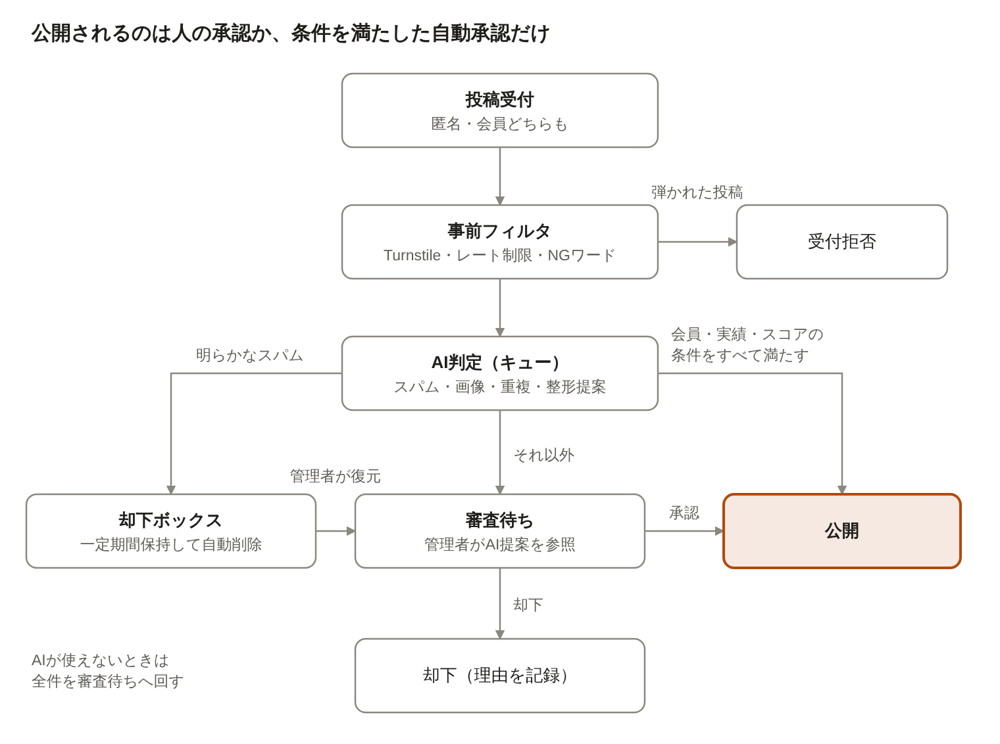

# ド田舎.net 要件定義書（香川版MVP）

Oct 6, 2026 · @ちょこ

## 1. 概要・目的

ド田舎.netは、香川県の田舎の魅力とイベントを集め、検索し、おすすめするポータルサイトである。投稿は全国から受け付ける。運営が情報源を巡回してイベントを集めるのは MVP では香川県のみとし、巡回する県は設定で増やせる構造で作る(2026-10-08 変更)。

イベントのページは利用者の投稿では作らない。利用者からは「情報提供」(情報元のWebページのURL、またはチラシ・回覧板の写真)を受け付け、それを読み取って運営がページを作る。イベントのページには情報元(Webページ、チラシの写真、管理者の現地確認のいずれか)を必ず載せる。参加した人は「行った!」と一緒に写真を足せる(審査あり)。スポットと体験談は従来どおり投稿できる(2026-10-08 変更)。

県・市区町村・合併前の旧町村ごとに地域ページを作り、成り立ちなどの歴史と特徴を紹介する(例: /kagawa/、/kagawa/marugame/、/kagawa/marugame/hanzan/)。紹介文はAIが情報元をもとに自動で作り、ファクトチェックして公開する。修正は受け付け、AIが情報元と照合して直す。全47都道府県と香川県の市町・旧町村は最初に用意し、それ以外はアクセスがあったときに作る(2026-10-08 追加)。

- **コンセプト**: 大手のおでかけサイトが拾わない、島・集落・秋祭り(獅子舞)・田舎の絶景など「小さくて濃い」情報を集める。
- **読者**: 香川県内の住民、移住・二拠点を検討している人、県外からの観光客。
- **情報の集め方**: 情報源の巡回(香川県)、利用者からの情報提供(Webページの URL、チラシ・回覧板の写真)、管理者の登録と現地確認、スポット・体験談の投稿(匿名可)。
- **運営**: 管理者は1名。審査の補助と下書き作成をAIが担う。
- **差別化**: 地元在住の管理者による現地情報と、投稿で集まる集落単位の行事・穴場。

## 2. 決定事項・前提条件

技術はLaravel+MySQLとし、chok.ooo(短縮URLサービス)と同じkagoyaのレンタルサーバーで動かす。

| 項目 | 決定内容 |
| --- | --- |
| 対象地域 | 投稿は全国47都道府県から受け付ける。巡回によるイベントの自動収集は香川県のみ(設定で県を増やせる) |
| ドメイン・URL | メインは ド田舎.net(`xn--gdkt37rmci.net`)。共有用に英字の `do-inaka.net` を持ち、同じパスのメインへ301で転送する。県はパスで分ける(例: `/kagawa/events/`)(2026-10-08 変更) |
| 技術 | Laravel 13、PHP 8.4、MySQL 8.0.46(ngram全文検索)。ソースは公開の GitHub リポジトリ choko1229/doinaka で管理する |
| 実行環境 | kagoya(レンタルサーバー)。cron、SSH、外部へのHTTPS通信、Imagick(HEIC対応)が使えることを確認済み(2026-10-08)。Composer はサーバーで動かさず、vendor を同梱したリリースZIPで設置・更新する |
| 更新 | サーバーが GitHub Releases を確認し、自動と手動の両方で更新する。自動更新はアクセスが少ない時間帯に行う(chok.ooo と同じ方式。2026-10-08 決定) |
| 地図 | Leaflet+国土地理院タイル(出典表示つき) |
| AI | OpenRouter経由で無料モデル(:free)を使う。費用上限は0円(運用後に見直し)。回数の上限は決めず、無料枠の制限エラーが出るまで使う。モデル名とAPIキーは管理画面で設定する |
| 認証 | 一般ユーザーはGoogleログイン。投稿はログインもメールも不要で可能 |
| 管理体制 | 管理者1名+AIによる補助 |
| 言語 | 日本語のみ。将来の多言語化に備えた設計にする |
| 収益化 | MVPからGoogle AdSenseと、地元事業者向けの独自掲載枠 |
| 公開時期 | 期限なし(品質優先) |
| 取材 | 管理者は香川在住。現地取材はできるが頻度は限られる |

設定値は原則DBで管理し、管理画面から変更できるようにする。`.env`にはDB接続情報やアプリケーション鍵など最小限の値だけを置く。

## 3. スコープ

MVPには、閲覧・検索・地図、地域ページ、情報提供と匿名投稿、情報源の巡回(香川県)、Googleアカウント、AI審査補助、自動更新、広告までを含める。AIによる推薦、多言語、巡回する県の拡大は後のフェーズに回す。

| 区分 | MVPに含める | 後のフェーズ |
| --- | --- | --- |
| 閲覧 | イベント、スポット、記事・体験談、地域ページ(県・市区町村・旧町村)、地図 | 多言語表示 |
| 検索 | キーワード、地域、日付、カテゴリ・タグ、現在地からの距離 | 全文検索エンジンの導入 |
| おすすめ | 人気順、関連・近くの情報、ルールベースの個人推薦 | AIによる推薦(推薦エンジンを差し替える) |
| 投稿 | イベントの情報提供(URL、チラシ・回覧板の写真)、スポット、記事・体験談、修正依頼、「行った!」の写真(匿名可・画像可) | 主催者・事業者向けの公式アカウント |
| 反応 | 「行った!」ボタン、アカウント限定のコメント(審査あり) | 星評価・口コミ |
| アカウント | Googleログイン、投稿履歴、編集・削除、お気に入り・行きたいリスト、プロフィール | 他のログイン方式 |
| AI | スパム判定、整形・要約・タグ提案、重複検出、画像の安全チェック、公開情報からの下書き作成、情報提供の読み取り、情報源の巡回の解析、地域ページの紹介文とファクトチェック、条件付き自動承認・自動却下 | オープンデータの自動取り込み |
| 管理 | 審査、情報提供の確認、全コンテンツ管理、地域ページ(再生成)、情報源の巡回、地域・カテゴリ管理、設定、ログ閲覧、アップデート、公開ページの管理者バー | 編集者ロールの管理画面 |
| 収益化 | AdSense、独自掲載枠 | アフィリエイト |
| 地域 | 投稿は全国47都道府県。巡回は香川県 | 巡回する県の追加(設定で県ごとにON) |

## 4. 利用者・権限

ロールは4つ用意し、MVPで画面を作るのは管理者までとする。編集者ロールは権限テーブルにだけ定義しておく。

| ロール | 認証 | できること |
| --- | --- | --- |
| 閲覧者 | なし | 閲覧、検索、地図、「行った!」(ブラウザ単位で重複防止)、イベントの情報提供、匿名投稿(スポット・体験談)、修正依頼 |
| 会員 | Googleログイン | 閲覧者の機能に加え、投稿履歴・審査状況の確認、自分の投稿の編集・削除(編集は再審査)、お気に入り・行きたいリスト、コメント、投稿者名とプロフィールの表示 |
| 編集者(将来) | 管理画面アカウント | 審査とコンテンツ編集。設定の変更はできない |
| 管理者 | 管理画面アカウント+2要素認証 | すべての操作。設定、AI、広告、ログ閲覧。公開ページでは管理者バーからも操作できる |

- 権限はロールと権限の対応表で判定し、画面ごとの決め打ちはしない。
- 会員は、人による承認実績と安全スコアの条件を満たすとAI自動承認の対象になる(詳細は8章)。
- 管理者が会員を停止すると、その会員は投稿・情報提供・コメント・反応ができなくなる。ログインと閲覧、マイページでの確認と退会はできる。

## 5. 機能要件

機能は公開側、投稿、アカウント、AI、管理、収益化の6群に分ける。IDは設計書や実装指示から参照するために使う。

### 5.1 公開側

| ID | 機能 | 要件 |
| --- | --- | --- |
| F-P01 | トップ | 今週末のイベント、人気、新着、特集、地域ページへの入口を表示する |
| F-P02 | イベント一覧・検索 | キーワード、地域(市区町村・旧町村)、日付(今日・今週末・期間指定)、カテゴリ・タグ、現在地からの距離で絞り込む。カレンダー表示つき |
| F-P03 | イベント詳細 | 日時、会場、地図、情報元(Webページ・チラシの写真・管理者の現地確認のいずれか。必ず1件以上)、参加者の写真、関連・近くの情報を表示する。終了後は「終了しました」と表示し、毎年開催の行事は次回開催へ誘導する |
| F-P04 | スポット一覧・詳細 | 常設の魅力スポット。イベントと同じ検索条件(日付を除く) |
| F-P05 | 記事・体験談 | 一覧と詳細。投稿者名(匿名なら「匿名」)と関連スポット・イベントを表示する |
| F-P06 | 地域ページ | 県・市区町村・合併前の旧町村の3階層。基本情報(人口・面積・合併の歴史)はすぐ表示し、成り立ちや特徴の紹介文はAIが情報元から作ってファクトチェック後に公開する。次の階層の一覧と、その地域のイベント・スポットを出す。内容の違いの知らせを受け付ける |
| F-P07 | 地図 | イベント・スポットをピンで表示し、カテゴリと日付で絞り込む |
| F-P08 | おすすめ | 人気順(閲覧数・お気に入り数・「行った!」数の重み付け)、関連・近くの情報、ログイン会員向けのルールベース個人推薦 |
| F-P09 | 反応 | 「行った!」ボタン(写真を添えられる。写真は審査あり)。アカウント限定のコメント(審査あり) |
| F-P10 | 現在地 | ブラウザの位置情報を許可制で取得し、サーバーには保存しない |
| F-P11 | 固定ページ | 利用規約、プライバシーポリシー(外部送信の公表を含む)、掲載・投稿ポリシー、運営者情報(活動名 choko1229。連絡はフォームのみ)、お問い合わせ(5種類。削除依頼を含む。メールは返信が必要な人だけ) |

### 5.2 投稿

| ID | 機能 | 要件 |
| --- | --- | --- |
| F-S01 | 投稿フォーム | スポット、記事・体験談の2種類。イベントは投稿では作らず、F-S06の情報提供で受け付ける。匿名(ログインもメールも不要)とログイン会員のどちらでも投稿できる |
| F-S02 | 画像 | 匿名でも添付できる。iPhone の HEIC も受け付ける。1枚10MBまで、記事・体験談は1投稿10枚、その他は5枚まで。保存時に自動圧縮(リサイズとWebP変換)し、位置情報(EXIF)を削除する。権利確認への同意を必須にする |
| F-S03 | 修正依頼 | 既存の掲載情報の誤り・中止・日時変更を報告する。公開はされず、管理者が内容を反映する |
| F-S04 | スパム対策 | Cloudflare Turnstile、IP単位のレート制限、NGワード・URL数制限、ハニーポット |
| F-S05 | 完了表示 | 匿名投稿には受付番号を表示する(状況確認用ではなく、問い合わせ時の照合用) |
| F-S06 | イベントの情報提供 | 情報元のWebページのURL、またはチラシ・回覧板の写真のどちらかが必須(地域とひとことは任意)。URLはAIがそのページだけを読んで下書きにし、管理者が確認して公開する。香川県外のURLも、そのページだけ読む。写真は管理者が個人名・電話番号などを隠してから下書きを作る。SNSのURLは理由を示して断る |
| F-S07 | 参加者の写真 | 「行った!」と一緒に写真を送れる。審査後にイベント詳細の「行った人の写真」に載る |

### 5.3 アカウント

| ID | 機能 | 要件 |
| --- | --- | --- |
| F-A01 | ログイン | Googleログイン(OAuth)。初回ログイン時に表示名を設定する |
| F-A02 | マイページ | 投稿履歴と審査状況(審査待ち・公開・却下と理由)を確認する |
| F-A03 | 編集・削除 | 自分の投稿を編集(再審査)・削除できる |
| F-A04 | リスト | お気に入り、行きたいリスト |
| F-A05 | プロフィール | 表示名と自己紹介。投稿者名として表示する |
| F-A06 | 退会 | 既定では投稿をすべて削除する。退会画面で、匿名化して残す方を本人が選ぶこともできる |

### 5.4 AI(OpenRouter経由)

| ID | 機能 | 要件 |
| --- | --- | --- |
| F-I01 | 一次判定 | スパム・不適切度のスコアと判定理由を出し、審査画面に表示する |
| F-I02 | 整形提案 | 表記ゆれの修正、要約、地域・カテゴリ・タグの推定。管理者が採否を選ぶ |
| F-I03 | 重複検出 | 既存の掲載・審査待ちの投稿との類似候補を示す |
| F-I04 | 画像チェック | 不適切画像と人物の顔の写り込みを検出する |
| F-I05 | 下書き作成 | 管理者が渡したURLから、日時・場所などの事実を抜き出して下書きにする。本文は転載せず、取得元URLと取得日時を記録する |
| F-I06 | 自動承認 | 条件を満たした会員の投稿・コメント・修正依頼のみ(8章)。ほかに信頼済み情報源の巡回結果(F-I09) |
| F-I07 | 自動却下 | 明らかなスパムのみ。却下ボックスに一定期間保持して、期限後に自動削除する |
| F-I08 | 障害時 | AIが使えないとき、または無料枠の制限エラーが出たときは、リセット(日本時間9時)後に優先順(管理者の操作 → 投稿の判定 → 情報提供の読み取り → 巡回 → 地域ページの紹介文)で自動処理する。急ぎのものは人が審査する。投稿受付は止めない |
| F-I09 | 情報源の巡回 | 香川県の市町・観光協会などの情報源(Webページ、RSS/Atom)をアクセスが少ない時間帯に巡回し、今日から1年先までのイベントを下書きにする。一覧と1階層下まで読み、robots.txt を守る。変化がなければ1→2→4→7日おきに間をあける。10件続けて修正なしで承認できた情報源は、管理者がONにすると自動公開になる(確信度0.9未満・既存との食い違い・中止や延期は人が確認)。3回続けて失敗したら一時停止して知らせる。新しい情報源の候補は、巡回中のリンクと情報提供のURLから集める |
| F-I10 | 地域ページの紹介文 | 情報元(自治体の沿革、統計など)から成り立ちと特徴の紹介文を作り、別の呼び出しで文ごとにファクトチェックして裏付けのない文を消してから公開する。出典2件以上でファクトチェック済みのページだけ検索に出す。内容の違いの知らせはAIが情報元と照合し、裏付けがあれば直し、なければ管理者に回す。管理者は再生成でき、新しい紹介文が確認を通るまで今の紹介文を出し続ける |

### 5.5 管理

| ID | 機能 | 要件 |
| --- | --- | --- |
| F-M01 | ダッシュボード | 審査待ち・修正依頼・却下ボックスの件数を未処理バッジで表示する。更新の結果と巡回の一時停止は Discord にも通知する |
| F-M02 | 審査 | 承認、却下(理由つき)、AI提案の採否、却下ボックスからの復元。匿名投稿は差し戻せないため、管理者が修正して承認するか却下する |
| F-M03 | コンテンツ管理 | イベント(行事マスタ+開催回)、スポット、記事、コメントの作成・編集・非公開・削除 |
| F-M04 | マスタ管理 | 地域(県・市区町村・旧町村)、カテゴリ、タグ、NGワード |
| F-M05 | 会員管理 | 会員一覧、停止・解除、承認実績の確認 |
| F-M06 | 設定 | AI(モデル、APIキー、閾値)、レート制限、却下ボックスの保持期間、広告、サイト情報、通知先(Discord)、自動更新 |
| F-M07 | ログ | 操作ログ、審査ログ、AI呼び出しログの閲覧 |
| F-M08 | 情報提供の確認 | 送られたURL・写真とAIの下書きを並べて確認し、直して公開するか見送る。写真は個人情報を隠してから使う。同じ行事があれば修正依頼に回す |
| F-M09 | 情報源の巡回 | 情報源の登録・停止・信頼済みの切り替え、候補の登録・無視、巡回の記録 |
| F-M10 | 地域ページ | 紹介文の状態(準備中・確認済み・不合格)、再生成、保留中の修正の反映・見送り |
| F-M11 | アップデート | 新しいリリースの確認、今すぐ更新、自動更新のON/OFFと時間帯、更新の履歴。失敗したら自動で元に戻す |
| F-M12 | 管理者バー | 2要素認証済みの管理者が公開ページを見ると上端に出し、管理画面への移動と、そのページの編集・中止・非公開・再生成などをその場で行える。公開ページのキャッシュには含めず、管理者の閲覧は閲覧数に数えない |

### 5.6 収益化

| ID | 機能 | 要件 |
| --- | --- | --- |
| F-R01 | AdSense | 広告枠の位置ごとにON/OFFを管理画面で切り替える |
| F-R02 | 独自掲載枠 | 地元事業者向けのPR枠。「PR」表記を必須とし、掲載期間を管理する |
| F-R03 | Cookie同意 | 広告とアクセス解析(Google Analytics 4)のCookieに対する同意バナー。人気順に使う閲覧数は自前で集計する |

## 6. データ要件

地域は階層テーブルで持ち、イベントは「行事マスタ」と「開催回」に分ける。これで巡回する県の拡大と毎年開催の行事に、作り直しなしで対応できる。

| エンティティ | 主な項目 | 備考 |
| --- | --- | --- |
| regions(地域) | 親ID、種別(県・市区町村・旧町村)、名前、読み、スラッグ、緯度経度、合併先と合併日、投稿の受付(全県ON)、巡回(香川県のみON) | 紹介文と統計は別に持つ(region\_profiles、region\_stats) |
| event\_series(行事マスタ) | 名前、説明、開催周期(毎年・不定期・単発)、地域、カテゴリ | 獅子舞・芸術祭などの継続行事 |
| events(開催回) | 行事ID、開始・終了日時、会場名、住所、緯度経度、料金、状態(予定・中止・終了) | 終了後もアーカイブとして残す |
| spots(スポット) | 名前、説明、地域、住所、緯度経度、営業情報、アクセス | 常設の魅力 |
| articles(記事・体験談) | 本文、投稿者、関連イベント・スポット | 長文コンテンツ |
| categories / tags | 名前、スラッグ、並び順 | 管理画面で編集する |
| media(画像) | ファイル、サイズ、代替テキスト、権利情報、投稿者、AI判定結果 | EXIFは削除してから保存する |
| submissions(投稿) | 種別、内容(JSON)、投稿者(会員または匿名)、IPのハッシュ、状態、AI判定、審査者、審査日時、却下理由 | 公開データとは分けて持つ |
| correction\_requests(修正依頼) | 対象、内容、状態、対応内容 | 公開されない |
| inquiries(お問い合わせ) | 受付番号、種類、対象URL、内容、メール(任意)、IPのハッシュ、状態 | 公開されない。対応が終わってから3年で削除(2026-10-08 決定) |
| sources(情報元) | 対象、URL、取得日時、ライセンス | AI下書きとオープンデータの出典表示に使う |
| event\_sources(イベントの情報元) | イベント、種別(Webページ・チラシの写真・管理者の現地確認)、URLまたは画像、取得日時 | 情報元が0件のイベントは公開できない |
| crawl\_sources ほか(巡回) | 情報源、ページごとのハッシュ、巡回の記録、候補 | 設計書9.6 |
| users(会員) | GoogleのID、表示名、メールアドレス、プロフィール、状態、承認実績数 | メールアドレスは管理者だけが見られる(公開しない) |
| favorites / visited / comments | 会員、対象、日時 | 「行った!」は匿名だとブラウザ単位 |
| ad\_slots(広告枠) | 位置、種別(AdSense・独自)、内容、掲載期間、有効フラグ |  |
| settings(設定) | キー、値(機密は暗号化)、更新者 | APIキーもここで暗号化して持つ |
| audit\_logs / ai\_logs | 操作者、操作、対象、日時、AIの入出力の要約、コスト |  |

- 文言はすべて翻訳ファイル経由で表示し、コンテンツは将来の翻訳テーブルを追加できる構造にする。
- 公開中のURLは変えない。スラッグを変更したときは旧URLからリダイレクトする。

## 7. 画面一覧

公開側は15画面、管理側は17画面とする。ほかに、公開ページの上端に管理者バーを出す。URLの頭に県のスラッグを付け、巡回する県を増やしても構造を変えない。

| 区分 | 画面 | URL例 |
| --- | --- | --- |
| 公開 | トップ | `/` |
| 公開 | 県トップ(県の地域ページを兼ねる) | `/kagawa/` |
| 公開 | 地域ページ(市区町村・旧町村) | `/kagawa/marugame/、/kagawa/marugame/hanzan/` |
| 公開 | イベント一覧・検索(カレンダー切替) | `/kagawa/events/` |
| 公開 | イベント詳細 | `/kagawa/events/{slug}/` |
| 公開 | スポット一覧・詳細 | `/kagawa/spots/`、`/kagawa/spots/{slug}/` |
| 公開 | 記事一覧・詳細 | `/kagawa/articles/`、`/kagawa/articles/{slug}/` |
| 公開 | 地図 | `/kagawa/map/` |
| 公開 | 情報提供・投稿フォーム・完了 | `/post/` |
| 公開 | 修正依頼フォーム | `/report/{type}/{id}/` |
| 公開 | ログイン・マイページ | `/login/`、`/mypage/` |
| 公開 | お気に入り・行きたいリスト | `/mypage/lists/` |
| 公開 | 投稿者プロフィール | `/users/{id}/` |
| 公開 | 固定ページ(利用規約・プライバシーポリシー、掲載・投稿ポリシー、運営者情報) | `/terms/` など |
| 公開 | お問い合わせ(削除依頼を含む)・受付 | `/contact/` |
| 管理 | ログイン(2要素認証) | `/admin/login/` |
| 管理 | ダッシュボード(未処理バッジ) | `/admin/` |
| 管理 | 審査一覧・審査詳細(AI判定表示) | `/admin/review/` |
| 管理 | 却下ボックス | `/admin/review/rejected/` |
| 管理 | 修正依頼 | `/admin/corrections/` |
| 管理 | お問い合わせ | `/admin/inquiries/` |
| 管理 | イベント(行事マスタ・開催回) | `/admin/events/` |
| 管理 | スポット・記事・コメント | `/admin/spots/` など |
| 管理 | AI下書き作成(URL入力) | `/admin/drafts/` |
| 管理 | 情報提供 | /admin/tips/ |
| 管理 | 情報源の巡回 | /admin/sources/ |
| 管理 | 地域ページ(再生成) | /admin/region-pages/ |
| 管理 | マスタ(地域、カテゴリ、タグ、NGワード) | `/admin/masters/` |
| 管理 | 会員管理 | `/admin/users/` |
| 管理 | 広告枠 | `/admin/ads/` |
| 管理 | 設定・ログ | `/admin/settings/`、`/admin/logs/` |
| 管理 | アップデート | /admin/update/ |

- 公開側はスマートフォンでの閲覧を優先して設計する。
- 一覧や絞り込みは、画面とは別のAPI(`/api/v1/`)から取得する。将来のアプリや外部連携に流用できるようにするため。

## 8. 投稿審査・運用フロー

投稿は原則として管理者が承認してから公開する。例外は、会員の投稿で自動承認の条件をすべて満たすもの、AIが明らかなスパムと判定したもの、信頼済み情報源の巡回結果(F-I09)、ファクトチェックを通った地域ページの紹介文(F-I10)である。

(図の SVG: `docs/design/diagrams/requirements-review-flow.svg`)

自動承認の条件は、会員であること、人による承認実績が一定数以上あること、AIの安全スコアが閾値以上であることの3つ。いずれも管理画面で設定する。

- **人物の顔が写った画像**: 自動承認の条件を満たしていても審査待ちに回す(10章の肖像権対応)。
- **修正依頼**: 公開しない。原則は管理者が確かめて反映する。自動承認の条件を満たし、情報元URLが添付されている場合はAIが自動で反映する。自動反映した変更は履歴に残してワンクリックで戻せるようにし、未処理バッジに「要確認」として表示する。
- **会員による編集**: 再審査する。審査が終わるまでは、公開中の版をそのまま表示する。
- **コメント**: 会員のみ。同じ流れで審査し、自動承認も適用する。
- **却下ボックスの削除**: cronで期限切れを削除し、添付画像も一緒に消す。
- **記録**: すべての判定(AI・人)とその理由を審査ログに残す。

## 9. 非機能要件

共用レンタルサーバーで動かす前提のため、重い処理はリクエスト中に行わず、cronで動くキューに回す。

| 分類 | 要件 |
| --- | --- |
| 性能 | 一覧・詳細はキャッシュを使う。画像はリサイズ・WebP化・遅延読み込みする。AI呼び出し、画像処理、却下ボックスの期限削除はキュー(cron)で処理する |
| 可用性 | AIや外部APIが止まっても、閲覧と投稿受付は継続する。AIが使えない間は全件を人の審査に回す |
| セキュリティ | CSRF・XSS・SQLインジェクション対策(Laravel標準+出力エスケープの徹底)。アップロードは拡張子とMIMEタイプの両方で検証し、画像は再エンコードする。管理画面は2要素認証とログイン試行制限。APIキーなどの機密設定は暗号化して保存する |
| プライバシー | IPアドレスはハッシュ化して保存し、一定期間後に削除する。現在地はサーバーに保存しない。画像の位置情報は削除する |
| ログ | 操作ログ、審査ログ、AI呼び出しログ(モデル、トークン数、費用、結果)、アプリケーションのエラーログ。管理画面から閲覧できる。トークンや Webhook URL などの秘密の値はログに出さない |
| エラー処理 | 例外はすべて捕捉してログに残し、利用者には内部情報を出さない汎用メッセージを表示する。外部API呼び出しにはタイムアウトとリトライ上限を設ける |
| AIの費用管理 | 無料モデルのみを使い、費用上限は0円とする。回数の上限は決めず、無料枠の制限エラーが出るまで使う。エラーが出たらリセット(日本時間9時)後に優先順で続ける。AIに送るのは公開予定の投稿内容だけで、IPなどの個人情報は送らない |
| SEO | イベント・スポット・記事・地域ページの構造化データ(schema.org)、サイトマップ、OGP、パンくずリスト、正規URL(ド田舎.net に統一)を設定する。日本では Google のイベントのリッチリザルトは表示されない。中身の薄いページと絞り込み付きの一覧は検索に出さない(設計書15章) |
| アクセシビリティ | 画像の代替テキスト、キーボード操作、十分なコントラスト比 |
| 保守性 | 型宣言の徹底、機能ごとのサービスクラス分割、AIプロバイダと推薦エンジンはインターフェースで差し替え可能にする。設定はDB管理 |
| バックアップ | DBと画像を定期バックアップし、復元手順を文書化する。更新の前にはDBとコードを自動でバックアップし(3世代)、失敗したら元に戻す |
| 更新 | サーバーが GitHub Releases を毎日確認して自動で更新する(管理画面から手動でも可)。自動更新はアクセスが少ない時間帯(直近28日の時間別閲覧数から毎週計算。データ不足のときは4時)に行う。入れ替え中はメンテナンス表示にし、ZIPは SHA-256 で照合し、結果は Discord に通知する |
| 日本語ドメイン | Punycode表記(`xn--`)での動作、OAuthのコールバックURL、メールやSNSでの表示を確認する。共有用に英字の do-inaka.net を使う |

## 10. 法務・著作権・プライバシー

匿名でも画像を投稿できるため、権利トラブルが起きたときにすぐ非公開にできる窓口と手順を、公開前に必ず用意する。

| 論点 | 対応 |
| --- | --- |
| 投稿画像の著作権 | 投稿時に「自分で撮影した、または掲載の許諾を得ている」への同意を必須にする。権利情報を画像ごとに記録する |
| 肖像権 | 祭りなど人物が写る写真が多い。AIが顔を検出した画像は自動承認の対象外とし、人が確認する。ぼかしは将来検討する |
| 外部情報の利用 | 巡回・情報提供・AI下書きで抜き出すのは日時・場所などの事実だけ。説明文と画像は転載しない。情報元を必ず表示し、robots.txt を守る |
| オープンデータ | ライセンス(CC BYなど)に従って出典を表示する |
| 集落の行事 | 地域内向けの行事は、公開してよいかを掲載前に確認する方針を掲載ポリシーに明記する |
| チラシ・回覧板の写真 | 個人名・電話番号・住所などは管理者が隠してから使い、隠す前の写真は公開しない |
| 削除依頼 | お問い合わせフォームの「削除依頼」で受け付け(対象URLと権利の種類が必須)、受け付けた対象はぼかして目立つ位置に「確認中」と表示する。AIが依頼と対象を照合し、管理者が削除か残すかを決めるまで削除しない。住所・電話・名前や人の写り込みの依頼は急ぎで通知する(2026-10-08 決定) |
| 個人情報 | Googleアカウントから取得するのは識別子、表示名、メールアドレスに限る。メールアドレスは管理者だけが見られ、プライバシーポリシーに利用目的を書く。IPはハッシュ化して期限付きで保存する |
| 広告 | AdSenseとアクセス解析のCookieについてプライバシーポリシーに記載し、同意バナーを表示する。独自掲載枠には「PR」を表記する(ステマ規制への対応) |
| 免責 | イベント情報は変更されることがあるため、最新情報は主催者に確認するよう明記する |
| 必要な文書 | 利用規約、プライバシーポリシー、掲載・投稿ポリシー、運営者情報 |

## 11. 決定した初期値と残りの確認事項

未決事項はすべて決まった。数値はすべて管理画面で変更できる。kagoya の実機確認は2026-10-08に済み、残る確認は1件である。

| 項目 | 決定内容 |
| --- | --- |
| AI自動承認 | 人による承認実績5件以上、かつAIの安全スコア0.9以上。投稿・コメント・修正依頼のすべてに適用する |
| 修正依頼の自動反映 | 情報元URLの添付が条件。変更履歴を残してワンクリックで戻せる。未処理バッジに「要確認」と表示する |
| 却下ボックスの保持期間 | 90日 |
| IPハッシュ | 90日保持。投稿は1IPあたり1時間に5件まで |
| AIモデル | OpenRouterの無料モデル(:free)。費用上限0円(運用後に見直し) |
| 無料枠の制限エラーが出たとき | 上限は決めず、エラーが出たらリセット(日本時間9時)後に優先順で自動処理する。急ぎのものは人が審査する |
| 画像チェック | 無料の画像対応モデルが使えない時期は、文章だけで判定し、少しでも怪しい画像付き投稿は人が審査する(自動承認は会員・実績5件以上・スコア0.95以上・注意フラグなしのときだけ。2026-10-08 変更) |
| AIに送るデータ | 公開予定の投稿内容、情報提供で送られた公開中のWebページ、削除依頼の内容と対象のページ。IP・メール・会員名は送らない。外国の事業者に送ることへの同意を各フォームで取る(個人情報保護法28条)。削除依頼は記録・学習しない提供元だけに送る(2026-10-08 変更) |
| 画像の上限 | 1枚10MB。記事・体験談は1投稿10枚、その他は5枚。保存時に自動圧縮する |
| カテゴリ(イベント) | 祭り・行事、体験・ワークショップ、食・マルシェ、アート・展示、花・季節、スポーツ・アウトドア |
| カテゴリ(スポット) | 絶景・自然、島、食・産直、歴史・文化、アート、体験施設、田舎の暮らし(無人販売所・渡し船など) |
| 人気順 | 閲覧1 : お気に入り5 : 「行った!」3、直近30日で集計 |
| 「行った!」の重複防止 | CookieとIPハッシュの併用。同じIPハッシュからは1日1回まで |
| 退会時の投稿 | 既定はすべて削除。本人が匿名化して残すことも選べる |
| AdSense | 公開中の記事・スポットが30件以上になったら申請。それまで広告枠はOFF |
| 独自掲載枠 | MVPは問い合わせで受け付け、管理者が手動で登録。料金は個別見積もり |
| アクセス解析 | Google Analytics 4で流入元を分析し、人気順用の閲覧数は自前で集計する |
| 運営者情報 | 活動名 choko1229(香川県在住の個人)だけを出す。本名・住所・電話は出さず、連絡はお問い合わせフォームだけ(2026-10-08 決定) |
| お問い合わせ | 一般の質問・不具合、削除依頼、掲載・修正の依頼(主催者)、広告・独自掲載枠の相談、個人情報についての5種類。メールは返信が必要な人だけ入れる(広告と個人情報は必須)。受付番号を表示する(2026-10-08 決定) |
| 「今週末」 | 土日と、それとつながる祝日・振替休日を含めた連休全体(2026-10-08 決定) |
| コメントの通報 | 3件で自動で非表示にし、管理者が確かめる。人が却下した投稿も却下ボックスと同じ90日で消す(2026-10-08 決定) |
| AI自動却下 | スコア0.05以下で、会員でない人の投稿だけ。運用開始から14日は却下せず記録だけ(2026-10-08 決定) |
| 海外からのアクセス | 日本のIPアドレス以外からは制限する。検索エンジンのクローラーと、規約・ポリシー・運営者情報・お問い合わせは制限しない(2026-10-08 決定) |
| 同意バナー | 日本向けの簡易版を自作。選ぶまでは GA4 とパーソナライズ広告を止める(2026-10-08 決定) |
| メールの送信 | お問い合わせへの返信と削除依頼の結果は、管理画面から contact@do-inaka.net で送る(2026-10-08 決定) |
| 削除依頼の同意照会 | 対象が会員の投稿なら、マイページで削除への同意を聞き、7日反対がなければ削除できる(情報流通プラットフォーム対処法3条2項2号。2026-10-08 決定) |
| 広告の配信事業者 | AdSense は Google の広告だけ。Google 以外の広告配信事業者は使わない(2026-10-08 決定) |
| 旧町村 | 平成の大合併前(34)と昭和の大合併前(150)の両方を載せ、どちらかをタグで示す(2026-10-08 決定) |
| イラスト | FV と写真がないときの代わりの画像は、ChatGPT で作るイラスト64枚(場所4×季節4×時間帯4)。季節と時間帯で切り替え、場所はページから分かれば合わせ、分からなければランダム(2026-10-08 決定) |
| リリースの番号 | v{西暦の下2桁}.{月}.{その月の何回目か}(例 v26.10.1)。ベータは【BETA】v26.10.1(2026-10-08 決定) |
| AI モデルの選び方 | 管理画面で用途ごとに第1候補と予備を選ぶ(候補は :free だけ)。消えたら予備に切り替えて Discord に通知(2026-10-08 決定) |
| 巡回で名乗る名前 | User-Agent は DoinakaBot/1.0 (+https://do-inaka.net/about/)(2026-10-08 決定) |
| ソースコード | 公開リポジトリだがライセンスは置かず All rights reserved。コード・コミット・PR は日本語(2026-10-08 決定) |

残りの確認事項:

- [ ] GoogleのOAuthで、日本語ドメインのコールバックURLを登録できるか確認する。登録はPunycode表記(xn--)で行い、アプリ側のURL設定もPunycode表記に揃える想定
